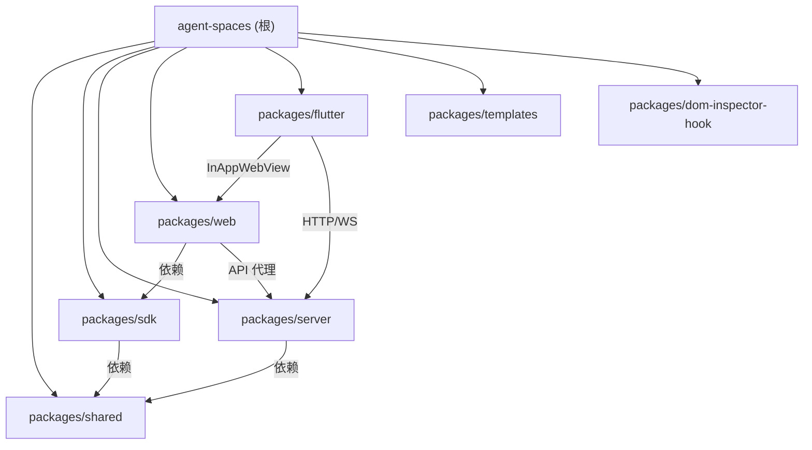

# Agent Spaces

Agent Spaces 是一个**本地多 Agent 协同编程平台**。基于 pnpm monorepo 组织 7 个包：`shared`（前后端共享类型）、`sdk`（前端 API 调用层）、`server`（Express 5 后端 + WebSocket + Agent 编排引擎）、`web`（Next.js 16 前端 SPA）、`flutter`（多平台原生壳应用）、`templates`（Agent / Chat / MCP / Skill / Plugin / Workflow 模板库）、`dom-inspector-hook`（浏览器端 DOM 源码定位 Hook）。

核心能力：6 种 Agent 运行时（Claude Code / Codex / Open Agent SDK / LangChain / Hermes / Oh-My-Pi）、Workflow DAG 可视化编辑器（含 command 节点 + UI 渲染节点）、Monaco 编辑器 + TypeScript LSP、频道聊天（含 Chat 独立页）、xterm 终端、Git 操作与 Worktree 并行开发、Issue 自动化、Kanban 看板、文档数据库（Notion 风格 + 向量搜索）、通知中心（飞书 / 企微 / Native）、Plugin 插件系统、Hook 引擎、订阅管理、Skill 系统。

数据持久化采用 JSON 文件 + SQLite（位于 `~/.agent-spaces-data/`），WebSocket 事件命名 `domain.action`，REST API 按资源分组并以 Bearer Token 鉴权。

## 约定的规则

- TypeScript strict 模式，ESNext 模块，后端 ESM（`"type": "module"`）
- 前端 Next.js App Router + `"use client"`；状态管理 Zustand（web）/ Riverpod（flutter）
- 前端 API 调用统一经 `@agent-spaces/sdk`（`packages/web/src/lib/sdk.ts` 单例）
- UI 基于 shadcn/ui（base-nova 风格），CSS 用 TailwindCSS 4
- REST 路由按资源分组，JSON body 上限 50MB，zod 做请求校验
- 状态字段使用联合字面量类型（非 `enum`），时间戳 ISO 字符串（Workflow 子树用 Unix 毫秒）
- WebSocket 事件命名 `domain.action`；WS 鉴权经 `token` 查询参数
- i18n 用 next-intl，按命名空间拆分（34 个命名空间 x 中/英）
- 文件名与目录名使用 kebab-case；ESM 导入路径带 `.js` 后缀
- 本项目使用 `codegraph` MCP 提供 AST 级代码知识图谱，优先于 grep/read

## 文件索引

| 文件 | 说明 |
|------|------|
| [claude/overview.md](claude/overview.md) | 项目总览、核心定位、技术栈、数据流 |
| [claude/conventions.md](claude/conventions.md) | 编码约定、命名规范、数据持久化规则 |
| [claude/module-responsibilities.md](claude/module-responsibilities.md) | 各模块职责概述 |
| [claude/entrypoints.md](claude/entrypoints.md) | 入口文件、启动命令、环境变量 |
| [claude/public-interfaces.md](claude/public-interfaces.md) | REST API、WebSocket 事件、页面路由、SDK |
| [claude/dependencies-and-config.md](claude/dependencies-and-config.md) | 依赖关系图、关键依赖、构建顺序、配置文件 |
| [claude/data-model.md](claude/data-model.md) | 持久化架构、核心类型、状态枚举 |
| [claude/testing-and-quality.md](claude/testing-and-quality.md) | 测试现状、验证命令、质量工具 |
| [claude/file-map.md](claude/file-map.md) | 文件地图、源码结构、文档目录 |
| [claude/faq.md](claude/faq.md) | 常见问题 |
| [claude/changelog.md](claude/changelog.md) | 变更记录 |

## 模块索引



| 模块 | 路径 | 语言 | 源文件数 | 职责 |
|------|------|------|----------|------|
| shared | `packages/shared` | TypeScript | 29 | 前后端共享类型定义（27 个子模块 + 1 入口 + 1 类型聚合） |
| sdk | `packages/sdk` | TypeScript | 42 | 前端 API 统一 SDK（39 个模块适配器，250+ 方法） |
| server | `packages/server` | TypeScript | 170+ | Express 5 后端 + WebSocket + 6 运行时 Agent 编排 + Workflow 引擎 |
| web | `packages/web` | TSX/TypeScript | 250+ | Next.js 16 前端 SPA（34 Store + 20 页面 + 30+ lib） |
| flutter | `packages/flutter` | Dart | 46 | Flutter 多平台壳应用（WebView + SSH 终端 + 多协议文件源） |
| templates | `packages/templates` | JSON/Markdown | 324+ | 模板库（Agent / Chat / MCP / Skill / Plugin / Workflow / Workflow-UI / Prompt / OutputStyle） |
| dom-inspector-hook | `packages/dom-inspector-hook` | TypeScript | 2 | 浏览器端 DOM 源码定位 Hook（HTTP 上报 / IDE 跳转） |

## 运行与开发

```bash
pnpm install          # 安装依赖（Node >= 20，pnpm >= 9）
pnpm dev              # 并行启动 server(3100) + web(3000)
pnpm build            # 构建（shared -> sdk -> server -> web -> copy）
pnpm build:docker     # Docker 构建（Dockerfile.server）
pnpm up               # docker compose up -d --build
pnpm lint             # 全包 lint（pnpm -r lint）
pnpm clean            # 清理 dist/.next/server web 产物
pnpm publish          # 构建 shared/server 并发布到 npm
```

## AI 使用指引

- `packages/web/AGENTS.md`、`packages/web/DESIGN.md` —— Next.js 16 注意事项、UI 设计规范（MiniMax 风格）
- `docs/` —— 40+ 项目文档，涵盖 Agent 运行时、Workflow、通知中心、Hook、LSP、Chat、Worktree、Workflow-UI 等
- `docs/superpowers/{plans,specs}/` —— 按日期归档的功能设计与实施计划
- `PRD.md` —— 需求文档
- `codegraph` MCP —— 基于 AST 的代码知识图谱，做结构性查询（定义/调用/影响面）时优先使用
- `fff` MCP —— 快速文件查找（frecency 排序）

## 扫描状态

- **更新时间**：2026-06-12 09:31:44
- **本次性质**：增量更新（自 2026-06-09）
- **已扫描范围**：全部 7 个模块的 package.json / pubspec.yaml / 入口文件 / 关键目录结构 / 配置文件
- **跳过范围**：node_modules、dist、.next、构建产物、二进制文件、.agent-spaces-data
- **覆盖率**：约 88%
- **本次新增**：补建 `packages/dom-inspector-hook/CLAUDE.md`（此前缺失）
- **主要缺口**：server 部分 service 子模块细节、web `components/` 个别子目录、flutter 单元测试（项目无测试）、templates 中 prompt/output-styles/workflow-ui 内容样本
