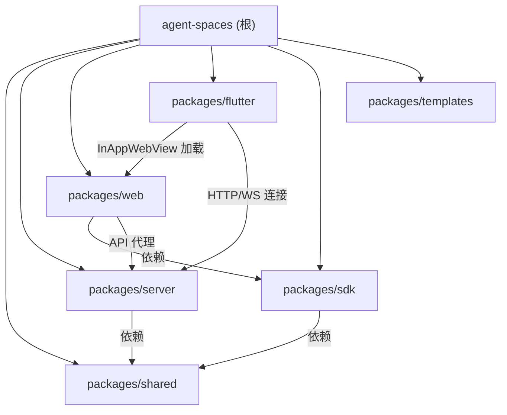

# Agent Spaces

## 项目愿景

Agent Spaces 是一个**本地多 Agent 协同编程平台**。用户在本地创建工作空间（Workspace），绑定代码目录，通过可视化 Workflow 编辑器（DAG 拓扑）编排 Agent 执行流程，或直接通过频道聊天 @mention Agent 触发执行。支持多种 Agent 角色（agent / scheduler / task_creator / bot / 以及自定义 role），六种 Agent 运行时（OpenAgentSdk / ClaudeCode / Codex / LangChain / Hermes / OhMyPi），前端提供 IDE 级别的集成开发环境体验，包含代码编辑器（Monaco + TypeScript LSP 实时类型检查/定义跳转/引用查找）、终端、频道聊天（含自动标题生成）、Git 操作（含 Commit Graph/Activity Graph/高级 Git 操作/自更新）、议题管理、工作流可视化编排（支持 Agent 节点和 Command 节点、WorkFox 引擎驱动的高级 DAG 执行：循环/分支/变量/断点/恢复/触发器/分组/嵌入编辑器/版本管理/插件系统）、用量统计仪表盘（含 Commit Graph + Activity Graph + Content Usage Report）、订阅余额管理、语音识别、快捷命令、命令面板、代码收藏、Prompt 模板管理、Hook 系统（Agent 工具调用前后自定义钩子）、输出风格管理、DOM Inspector 源码定位、i18n 中英文切换（按命名空间拆分的 next-intl 多文件架构，覆盖 30+ 命名空间）、Kanban 看板管理、Notion 风格文档数据库（含向量搜索）、Worktree 并行开发、Robot Account 通知凭证管理、字体管理、版本自更新系统、Diff Viewer、JSON Viewer、Log Viewer、主题风格系统、布局模板管理、Agent Store 独立管理、终端注册表、Send to Issue/Channel、AI 标题生成、通用 AI 文本请求层、数据导入/导出（cc-switch 迁移 + ZIP 归档）、Plugin 插件系统（Workflow 自定义节点 + 配置管理 + Store 安装）等核心功能。支持通过飞书/企业微信 Bot 接收 Issue 状态通知并远程操控 Agent。

## 架构总览

- **项目类型**：pnpm monorepo（6 个包）+ Flutter 客户端（独立 pubspec）
- **前端**：Next.js 16 (App Router) + TailwindCSS 4 + shadcn/ui + FlexLayout + Zustand + Monaco Editor（含 TypeScript LSP 语言客户端）+ xterm.js + TipTap 富文本编辑器 + @xyflow/react (DAG 可视化) + next-intl (i18n，按命名空间拆分多文件) + cmdk (Command Palette) + framer-motion (动画) + jalco-ui (Commit Graph/Activity Graph/Log Viewer/Json Viewer)
- **前端 SDK**：@agent-spaces/sdk（39 模块的统一 API 调用层，HttpClient 封装 + Bearer Token 自动注入 + 调试日志）
- **移动端/桌面端**：Flutter 3.10 + Riverpod + InAppWebView + GoRouter + awesome_notifications + docking，内嵌 Web 前端的多平台原生壳应用，支持远程终端（SSH/SFTP/FTP/WebDAV）
- **后端**：Express 5 + WebSocket (ws) + node-pty + simple-git + node:sqlite (SQLite) + zod
- **共享层**：TypeScript 类型定义包，前后端共用
- **SDK 层**：前端 API 统一调用包（@agent-spaces/sdk），按模块拆分 39 个 API 适配器，web 通过 sdk.ts 单例消费
- **模板层**：Agent 预设模板包（@agent-spaces/agents），含 184+ 预制 Agent 模板（academic/design/engineering/finance/game-development/marketing 等分类）+ 6 Chat Agent 模板，支持 Store 在线导入
- **数据存储**：JSON 文件持久化（`~/.agent-spaces-data/`）+ SQLite（Agent Session/Usage 统计 + Kanban Board + DocNode 文档数据库），无外部数据库
- **认证系统**：基于 Secret Key 的 Bearer Token 认证，全局中间件保护 API + WebSocket 连接
- **Agent 运行时**：支持六种运行时 -- `OpenAgentSdkRuntime`（基于 @codeany/open-agent-sdk）、`ClaudeCodeRuntime`（基于 @anthropic-ai/claude-agent-sdk，已拆分为 7 文件子模块）、`CodexRuntime`（基于 @openai/codex-sdk + CodexFunctionToolBridge MCP 桥接）、`LangChainRuntime`（基于 langchain）、`HermesRuntime`（外部 Hermes CLI 进程适配）、`OhMyPiRuntime`（外部 omp CLI 进程适配），通过工厂函数 `createAgentRuntime()` 按配置切换
- **Anthropic Bridge**：ClaudeCodeRuntime 内置 Anthropic Messages 到 OpenAI Chat Completions/Responses 的协议中转，支持通过 Claude Code SDK 调用非 Anthropic 模型
- **通用 AI 文本请求**：`services/ai-text.ts` 抽象层，统一支持 Anthropic/OpenAI/Gemini 三种供应商的文本生成请求，供标题生成、Agent Designer 等功能使用
- **AI 标题生成**：频道创建和 Issue 创建时自动通过 AI 生成标题（Title Generator Agent），后台异步执行，生成后自动更新并通过 WebSocket 推送
- **持久上下文**：`persistent-agent-context.ts` 自动加载工作空间中的 CLAUDE.md/AGENTS.md 指令文件和 Workspace Prompt，注入所有 Agent 运行时（聊天/Issue/SSE/Bot）
- **Hook 系统**：Agent 工具调用前后的自定义钩子系统，支持 shell command/webhook/script 三种动作类型，per-tool-call 粒度，工作空间级别 `.hook.json` 文件存储，通过 `wrapOnEventWithHooks()` 拦截 `AgentRuntimeEvent`
- **输出风格管理**：自定义 Agent 输出格式模板（Markdown），按工作空间持久化，Agent 运行时通过 `resolveOutputStyleContent()` 注入 systemPrompt
- **通知中心 (Notification Hub)**：支持飞书（Lark）和企业微信（WeChat）和 Native（Tauri/Browser）三种外部通知渠道，Issue/Task 状态变更自动推送，支持 Bot Agent 远程对话和内置斜杠命令；另有应用内通知系统（NotificationCenter + NotificationType）
- **Robot Account 系统**：集中管理飞书/企微通知凭证（RobotAccount），工作空间通过 `robotAccountId` 引用，支持全局企微 QR Code 登录自动创建凭证
- **工作流系统 (Workflow)**：基于 WorkFox 引擎的 DAG 可视化模板编辑器（@xyflow/react），支持 Agent 节点、Command 节点、分组节点、循环节点、插件节点，含执行引擎（execution-manager 1557 行，支持 DAG 遍历/循环/分支/变量/断点/恢复）、交互管理器（interaction-manager，alert/prompt/form/table_confirm）、触发器服务（workflow-trigger-service，cron + webhook）、版本管理（workflow-store 支持版本目录存储 + 执行日志 + 插件配置）、WebSocket 执行通道（execution-channels）、Workflow Webhook Hook（SSE 流式结果）、Plugin 插件系统（自定义节点类型 + 配置管理 + Store 安装 + CJS 沙箱加载 + 执行引擎集成）、前端 58 文件完整编辑器（含属性面板/变量选择器/版本面板/暂存面板/操作历史/执行栏/触发器对话框/插件对话框/插件选择器/插件配置/交互对话框/Agent Chat UI/执行输入/导入预设等）、Workflow Share 页面（/workflows/share，支持执行结果展示 + 文件下载）
- **Worktree 系统**：Git Worktree 并行开发支持，每个 Worktree 关联独立分支，支持创建/删除/Diff 查看/PR 创建（含 AI 生成 PR 描述）/PR 合并
- **Kanban 看板**：工作空间级看板管理（SQLite 存储），支持多列拖拽排序（@dnd-kit）、任务 CRUD、水平/垂直布局切换、优先级筛选、搜索过滤
- **文档数据库 (Database)**：Notion 风格的树形文档系统（SQLite 存储），支持创建/移动/软删除/恢复、Notion 编辑器 + Markdown 编辑器双模式、封面/图标、快速搜索、回收站、多标签页、向量搜索（Embedding 索引）、版本历史、AI 对话
- **文档向量搜索**：基于 LLM Embedding 的文档语义搜索（database-vector.ts），支持批量索引、相似度查询、调试信息
- **用量统计与计费**：SQLite 存储 Agent 每次执行的 Token 用量和费用估算，首页 Dashboard 展示趋势图和按模型统计
- **订阅管理 (Subscription)**：支持智谱 (ZhiPu)、MiniMax、AI Code 三种供应商的余额/配额查询，首页展示订阅面板
- **语音识别 (Speech Recognition)**：腾讯语音实时识别（WebSocket 流式），前端 useSpeechRecognition Hook 集成到聊天输入
- **快捷命令 (Quick Commands)**：自定义命令 CRUD + 运行/停止/自动重启，前端终端集成
- **代码搜索 (Code Search)**：ripgrep 优先 + Node.js 回退，支持正则/文件模式/大小写选项
- **代码收藏 (Code Favorites)**：Monaco 编辑器右键收藏代码位置/片段，侧面板查看/跳转/删除，按工作空间持久化
- **Prompt 模板管理**：CRUD + 应用到多个 Agent 预设，独立设置页 /settings/prompts
- **Agent SSE API**：HTTP Server-Sent Events 流式 Agent 调用，无需 WebSocket，支持外部集成
- **Agent Commands**：Agent 命令管理（CRUD + 批量应用到多个 Agent），独立 REST API
- **TypeScript LSP**：后端启动 typescript-language-server 子进程，前端 monaco-languageclient 通过 WebSocket 连接，提供定义跳转/引用/诊断等 TypeScript 语义能力
- **DOM Inspector**：基于 dom-inspector-hook 的元素源码定位，被调试项目 Alt+Shift 点击自动在编辑器中打开源文件
- **Command Palette**：Ctrl+K 快捷命令面板（cmdk），全局搜索（工作空间/频道/Issue/文件/服务器）
- **Git 操作日志**：内存 Git 操作审计日志（git-operation-log.ts），记录每次 Git 操作的输入/输出/耗时
- **多服务器支持**：前端支持配置和切换多个后端服务器实例
- **i18n 国际化**：next-intl + LocaleProvider，中英文切换，31+ 命名空间按功能拆分（agent/agentCommands/chat/commandPalette/commands/composer/common/database/editor/folderPicker/git/home/issue/kanban/login/mcps/models/outputStyles/projectSettings/prompts/providers/robotAccounts/settings/sidebar/skills/task/terminal/tools/workflows/workspace/workspaces/worktree 等各独立 JSON 文件），60+ 组件已完成改造
- **Tauri 集成**：Zoom Wrapper + Native Notification + 静态路由适配
- **Timeline**：版本发布时间线展示（v1.1.0 / v1.2.0 / v1.3.0）
- **字体管理**：自定义字体上传/删除/列表 API（支持 ttf/otf/woff/woff2）
- **版本自更新**：server 内置版本检查（npm registry）+ 自更新脚本（POST /api/version/update），前端 Dashboard 展示更新状态
- **Commit Graph**：jalco-ui 风格的 Git 提交历史图形可视化
- **Activity Graph**：GitHub 风格的 Agent 活动热力图
- **Diff Viewer**：通用 Diff 查看器（unified/split 布局，基于 diff 库）
- **主题风格系统**：自定义主题风格（Mira 等多种预设 + 自定义 CSS），按 localStorage 持久化，运行时动态注入
- **布局模板管理**：FlexLayout 布局模板的保存/加载/切换，localStorage 持久化
- **Content Usage Report**：内容使用量报告（stores + workspace 代理配置 + 终端实例等综合统计），独立对话框展示
- **Agent Store**：Agent 预设在线商店，支持从 GitHub 仓库导入/同步 Agent 模板
- **终端注册表**：全局终端实例注册与统计（terminal-registry.ts），用于 Content Usage Report
- **Send to Issue/Channel**：Monaco 编辑器右键发送代码片段到 Issue 或 Channel
- **数据导入/导出**：cc-switch 迁移路由（routes/import.ts，从 ~/.cc-switch 导入 providers/skills/MCPs）+ 数据归档 API（routes/data.ts，ZIP 导入/导出，支持 15+ 数据类别）
- **Plugin 插件系统**：Workflow 自定义插件节点系统，支持插件安装/启用/禁用/配置/Store 导入，CJS 沙箱加载 + vm.Script 执行，插件节点通过 execution-manager 集成到 DAG 执行引擎
- **Chat 独立页面**：独立的 AI 对话页面（/chat），支持多 Agent 管理、SSE 流式执行、技能配置、结构化消息渲染，独立于频道聊天的轻量级对话体验
- **NPM Settings 管理**：NPM 配置管理 API（GET/PUT /api/npm-settings），支持代理等设置

### 技术栈

| 层级 | 技术 | 版本 |
|------|------|------|
| 运行时 | Node.js | >= 20 |
| 包管理 | pnpm | >= 9 |
| 语言 | TypeScript | 5.8+ |
| 前端框架 | Next.js | 16.2 |
| UI 库 | shadcn/ui (base-nova) + TailwindCSS 4 | - |
| 布局引擎 | FlexLayout React | 0.9 |
| DAG 编辑器 | @xyflow/react | 12.10 |
| DAG 布局 | @dagrejs/dagre | 3.0 |
| 状态管理 | Zustand | 5 |
| 代码编辑 | Monaco Editor | 4.7 |
| Monaco LSP 客户端 | monaco-languageclient | 10.7 |
| TypeScript LSP 服务端 | typescript-language-server | 5.2 |
| LSP 通信 | vscode-ws-jsonrpc | 3.5 |
| 终端 | xterm.js (@xterm/xterm) | 6 |
| 富文本编辑 | TipTap (含 mention、placeholder、slash 扩展) | 3.22 |
| i18n | next-intl | 4.11 |
| Command Palette | cmdk | 1.1 |
| 动画 | framer-motion | 11 |
| 后端框架 | Express | 5 |
| WebSocket | ws | 8 |
| PTY | node-pty | 1.1 |
| Git 操作 | simple-git | 3.36 |
| 数据库 | node:sqlite (SQLite) | 内置 |
| Schema 校验 | zod | 4 |
| MCP SDK | @modelcontextprotocol/sdk | - |
| Agent SDK 1 | @codeany/open-agent-sdk | ^0.2.1 |
| Agent SDK 2 | @anthropic-ai/claude-agent-sdk | ^0.2.126 |
| Agent SDK 3 | @openai/codex-sdk | ^0.128.0 |
| Agent SDK 4 | langchain + @langchain/openai + @langchain/anthropic + @langchain/google-genai | ^1.4.0 |
| Agent SDK 5 | Hermes CLI（外部进程） | - |
| Agent SDK 6 | omp CLI / @oh-my-pi/pi-coding-agent（外部进程） | - |
| 飞书 SDK | @larksuiteoapi/node-sdk | ^1.62.1 |
| 图表 | Recharts | 3.8 |
| 表格 | @tanstack/react-table | ^8.21.3 |
| 拖拽 | @dnd-kit/core + @dnd-kit/sortable | ^6.3.1 |
| 拖放面板 | react-resizable-panels | - |
| 移动端框架 | Flutter | ^3.10.1 |
| 移动端状态管理 | flutter_riverpod | ^2.6.1 |
| 移动端 WebView | flutter_inappwebview | ^6.1.5 |
| 移动端路由 | go_router | ^14.8.1 |
| 移动端通知 | awesome_notifications | ^0.11.0 |
| 移动端 Docking | docking | - |

## 模块结构图



## 模块索引

| 模块 | 路径 | 语言 | 文件数 | 职责 |
|------|------|------|--------|------|
| shared | `packages/shared` | TypeScript | 29 | 前后端共享类型定义（Unified Workflow Types from WorkFox: Workflow/WorkflowNode/WorkflowEdge/WorkflowGroup/WorkflowFolder/ExecutionLog/ExecutionStep/EngineStatus + Execution Events + Error Codes + Plugin Types + Composite Nodes + WS Protocol + Shortcuts，以及 Workspace, Issue, IssueComment, Task, Agent, AgentUsageRecord, AgentUsageDashboard, Channel, Message, MessagePart, Event, File, Git, LLM, Tool, Command, Subscription, Search, Notification, Speech, CodeFavorite, Hook, DocNode, DatabaseMeta, DatabaseVectorStats, DatabaseVectorSearchResult, DatabaseNodeVersion, KanbanBoard, WorktreeInfo, RobotAccount, GitOperationEntry） |
| sdk | `packages/sdk` | TypeScript | 39 | 前端 API 统一 SDK（@agent-spaces/sdk），HttpClient 封装 + Bearer Token 自动注入 + 调试日志 + 39 个 API 模块（workspace/agent/channel/issue/task/git/editor/llm/workflow/workflow-plugin/kanban/database/worktree/hooks/command/subscription/notification/speech/code-favorites/prompts/skills/mcps/output-styles/tools/robot-accounts/auth/data/version/search/agent-store/font/inspector/avatar/agent-commands/npm-settings/chat），web 通过 sdk.ts 代理单例消费 |
| server | `packages/server` | TypeScript | 168 | Express REST API + WebSocket 服务 + 认证中间件 + 六运行时 Agent 编排（OpenAgentSdk/ClaudeCode/Codex+MCPBridge/LangChain/Hermes/OhMyPi） + Chat 系统（Chat Agent CRUD + 消息管理 + LangChain SSE 流式执行 + WebSocket handler 提取 + per-workspace JSON 持久化） + 通用 AI 文本请求层（ai-text.ts，支持 Anthropic/OpenAI/Gemini） + AI 标题生成（Title Generator Agent） + Workflow 系统（WorkFox 引擎：execution-manager 1557 行 DAG 执行引擎 + interaction-manager 交互管理 + workflow-trigger-service cron/webhook 触发器 + workflow-store 版本目录存储 + workflow-hook SSE 流式 Webhook + execution-channels WS 执行通道） + Plugin 插件系统（plugin.ts + plugin-runtime-api.ts：插件安装/启用/禁用/配置/Store 导入/CJS 沙箱加载/vm.Script 执行/自定义 Workflow 节点/运行时 HTTP 请求 API） + Hook 系统（Agent 工具调用前后钩子 + shell/webhook/script 动作） + 输出风格管理（OutputStyle 模板 CRUD + 运行时注入） + 通知中心（飞书/企微/Native Bot + Robot Account 凭证管理 + service/bot-agent 提取） + 应用内通知 + PTY 终端（提取为独立服务） + Git 操作（含 Git Operation Log + 高级操作 init/branch/checkout/tag/cherry-pick/stage/unstage/remote） + SQLite Agent Usage + Kanban Board（SQLite 看板管理） + DocNode 文档数据库（SQLite 树形文档系统 + 向量搜索） + Worktree 并行开发（创建/删除/Diff/PR 创建/AI PR 描述/合并） + JSON 持久化 + LLM 管理 + Agent Preset + Function Call Tools（Issue/Command/Database/Kanban/WorkflowExec/WorkflowEditor 六类内置工具） + Agent Commands 管理 + Anthropic Bridge + Issue 评论与服务层 + 工具详情持久化 + Commit Agent + Pull Request Agent + 用量 Dashboard API + 文件夹浏览 + Git Clone SSE + Agent SSE API + 代码搜索（ripgrep + gitignore 过滤） + 订阅管理（智谱/MiniMax/AICode） + 语音识别（腾讯） + 快捷命令 + Agent Designer + Skill/MCP 管理 + Prompt 模板管理 + 代码收藏 + 持久上下文加载 + TypeScript LSP 服务 + DOM Inspector 端点 + 字体管理 API + 版本检查与自更新系统 + NPM Settings 管理 + 数据导入（cc-switch 迁移）+ 数据归档（ZIP 导入/导出） + zod 校验 |
| web | `packages/web` | TypeScript/TSX | 493 | Next.js 前端 SPA，包含登录页（含 hero 装饰 + rotating-text）、工作空间管理、代码编辑器（Monaco + TypeScript LSP 定义跳转/引用/诊断 + Model 缓存 + 搜索面板 + 导入文件对话框 + 代码收藏面板 + Monaco Action Registry + 菜单栏 + 移动端适配 + Send to Issue/Channel + Inspector Action）、终端（快捷命令 + 虚拟键盘 + 命令侧边栏 + 终端实例 + 终端注册表）、Chat 独立页面（/chat：inline-chat-panel/chat-panel/chat-message-bubble/chat-agent-list/chat-agent-picker-dialog/chat-right-panel/add-chat-agent-dialog/chat-composer-input/readonly-code-block/member-hover-card/message-parts/ask-user-question/chain-of-thought/chat-input/chat-input-agent-bar/chat-input-info-bar + LangChain SSE 流式 + stores/chat.ts）、结构化 AI 消息渲染（含 tool-step/context-panel/context-usage/chain-of-thought/commit 组件）、TipTap 富文本聊天（slash 命令扩展）+ @mention + 回复 AI 消息工作流 + agent resource 扩展 + suggestion renderer + composer dialog/editor 双组件、语音识别输入、议题管理（含 Workflow 选择 + 拖拽排序任务面板 + info panel + issue message）、Workflow 可视化编辑器（58 文件完整 WorkFox 编辑器 + 独立页面 /workflows/[id] + /workflows/share 分享页：@xyflow/react DAG + workflow-editor/workflow-canvas/workflow-node/workflow-edge/workflow-properties-panel（含 10+ 属性子组件：fields-array/fields-conditions/fields-output/fields-property/properties-fields/properties-import-dialog/properties-io-sections/properties-list/properties-preset-dialog/properties-toolbar/properties-utils）/workflow-variable-picker/workflow-version-panel/workflow-staging-panel/workflow-operation-history/workflow-execution-bar/workflow-trigger-dialog/workflow-embedded-editor/workflow-group-node/workflow-loop-body-container/workflow-node-sidebar/workflow-editor-toolbar/workflow-plugins-dialog/workflow-plugin-picker-dialog/workflow-plugin-config-dialog/workflow-interaction-dialog/workflow-editor-agent-chat-ui/workflow-execution-input-dialog/workflow-execution-node-dialog/workflow-save-preset-dialog/workflow-list-dialog/workflow-info-dialog 等 + @dagrejs/dagre 自动布局）、Git 面板（含设置表单 + commit diff viewer + context menu + discard 对话框 + 远程同步 Hook + commits panel + commit log list + 高级操作 + git-not-initialized + git-remote-dialog + git-op-log-dialog + git-changes-panel）、频道管理（频道对话框 + 频道信息面板 + 成员管理 + 成员卡片 + member-picker + AI 标题自动生成）、Agent 配置 + 命令管理对话框、LLM 管理（模型 + 供应商对话框 + Model Picker）、头像上传、用量统计仪表盘（含 Commit Graph + Activity Graph + Content Usage Report + Workflow Execution Panel）、订阅余额面板、项目设置面板（通知配置+Prompt配置+Git 配置+Speech 配置+Robot Accounts Tab）、服务器切换器/管理器、文件夹选择器、移动端适配、i18n 中英文切换（31+ 命名空间按功能拆分，60+ 组件已改造）、Native 通知（Tauri/Browser）、Command Palette（Ctrl+K）、Iframe Tab 管理器、浮动面板/浮球、Inspector 历史记录、独立设置页（Agents/Skills/MCPs/Models/Providers/Prompts/OutputStyles/Hooks/Tools + Data 导入导出 Tab + NPM Settings Tab）、通知中心对话框、Hook 管理对话框、输出风格管理对话框、DOM Inspector 集成、Providers 管理对话框、Kanban 看板（@dnd-kit 拖拽 + 水平/垂直布局 + 列管理对话框）、Notion 风格文档数据库（树形导航 + Notion/Markdown 双编辑器 + 快速搜索 + 回收站 + 向量搜索 + 版本历史 + AI 对话 + 目录树节点 + 侧边栏双面板）、Worktree 面板（创建/删除/PR 创建/Diff 查看）、版本发布时间线（Timeline）、Settings 对话框拆分（Appearance/Language/Account/Security/Git/Speech/RobotAccounts/Startup + NPM Settings Tab + Shortcuts Tab + About Tab + Custom Font + Agent Store Tab）、Agent Picker 对话框、Editor 增强（file-tree/file-icon/file-context-menu/editor-tabs/editor-panel）、Agent Store 独立管理（在线导入/同步）、Diff Viewer（unified/split）、JSON Viewer、Log Viewer、Activity Log Panel、Animated Theme Toggler、Text Shimmer、Wandering Eyes、Ring Loading、Theme Style Init、主题风格系统（Mira 等预设 + 自定义 CSS）、布局模板管理、Auth Guard、App Shell、Workspace Shell + Tab Config、Keyboard Shortcuts Store、GitHub Contributions、ForgeUI Animated Tabs、Skills Dialog 子目录（11 文件，含 git-import/filter-sidebar/card-grid）、SDK 统一 API 调用层 |
| flutter | `packages/flutter` | Dart | 46 | Flutter 多平台原生壳应用（Android/iOS/macOS/Windows/Web），内嵌 InAppWebView 加载 Web 前端，提供原生通知、设备模拟（Phone/Tablet/Desktop）、书签管理、内网服务器自动发现（/api/health 探测）、JS Bridge 双向通信（Flutter <-> WebView 事件+RPC）、控制台日志捕获、Tab 管理（docking 多窗口布局）、Split Layout、右键菜单、Tab 对话框、调试工具、终端实例（内嵌终端 + 工具栏 + 虚拟键盘 + SSH/SFTP 登录表单）、远程文件浏览（SFTP/FTP/WebDAV/本地存储 四种文件源 + FileSourceTree 组件）、终端凭证管理（SSH 凭证 CRUD）、文件源凭证管理（远程连接配置 CRUD） |
| templates | `packages/templates` | JSON/Markdown | 324 | Agent 预设模板库（@agent-spaces/agents），含 184 Agent 预设（15 分类）+ 6 Chat Agent 模板（code-assistant/creative-consultant/data-analyst/study-tutor/translation-assistant/writing-assistant）+ 9 MCP + 15 Skill + 107 Plugin + 1 Workflow + Prompt + Output Style 模板，支持 generate-index 自动索引 + http-server 静态托管 + Store 在线导入 |

## 运行与开发

```bash
# 安装依赖
pnpm install

# 并行启动 server + web（开发模式）
pnpm dev
# server: http://localhost:3100
# web:    http://localhost:3000（自动代理 /api/* 和 /ws 到 server）

# 构建
pnpm build

# Docker 构建
pnpm build:docker

# 清理
pnpm clean
```

### Flutter 客户端

```bash
cd packages/flutter

# 获取依赖
flutter pub get

# 运行（开发模式，需连接设备或模拟器）
flutter run

# 构建 APK
flutter build apk

# 构建 iOS
flutter build ios

# 构建 macOS
flutter build macos

# 运行测试
flutter test
```

### 环境变量

| 变量 | 默认值 | 说明 |
|------|--------|------|
| `PORT` | `3100` | 后端服务端口 |
| `HOST` | `0.0.0.0` | 后端服务监听地址 |
| `AGENT_SPACES_DATA_DIR` | `~/.agent-spaces-data` | 数据存储目录 |
| `ANTHROPIC_API_KEY` | - | ClaudeCodeRuntime 使用的 API Key |
| `ANTHROPIC_BASE_URL` | - | ClaudeCodeRuntime 使用的 API Base URL |
| `CLAUDE_CODE_MODEL` | - | Claude Code SDK 覆盖模型名（仅 Anthropic Bridge 模式） |
| `NEXT_PUBLIC_WS_PORT` | `3100` | 前端 WebSocket 连接端口 |
| `CODEX_API_KEY` / `OPENAI_API_KEY` | - | CodexRuntime 使用的 API Key |
| `CODEX_HOME` | - | Codex 配置目录（默认每个 agent 独立） |
| `SERVER_URL` | `http://localhost:3100` | 前端 SSR 时连接后端的 URL |
| `CORS_ORIGIN` | `*` | CORS 允许的来源 |

### 核心开发流程

1. 配置 Secret Key（`~/.agent-spaces-data/auth.json`）-> 登录页认证
2. 创建工作空间 -> 绑定本地目录（支持文件夹浏览器 + Git Clone SSE）-> 自动初始化 `.agentspace` 元数据目录
3. 配置 Agent Preset（角色、运行时类型、模型、API Key、MCP、技能、权限模式等）
4. 创建 Workflow 模板（可视化 DAG 编辑器，支持 Agent/Command/Group/Loop/Plugin 节点，连线定义依赖，版本管理，触发器配置，插件集成）或使用已有模板
5. 创建议题（Issue）-> 可选择 Workflow 模板 -> 启动 Issue 自动化
6. Issue 自动化入口：若有 workflowId，加载 Workflow -> 映射为 Task -> 依赖调度执行 -> 全部 Task 完成后 Issue completed；若无 workflow，Issue 进入 error
7. 也可在频道聊天中 @mention Agent 直接触发执行，或使用 Agent SSE API（HTTP POST）外部调用
8. Agent 执行时实时展示 chain（工具调用/中间输出/最终结论）、工具详情（input/output/diff）、token 使用统计
9. 所有状态变更通过 WebSocket 实时推送到前端，同时触发通知中心事件
10. 首页 Dashboard 展示 Agent 用量趋势、Token 消耗、费用估算、按模型统计、Commit Graph、Activity Graph
11. 首页订阅面板展示智谱/MiniMax/AICode 余额和配额
12. 项目设置面板配置工作空间 Prompt、通知服务（飞书/企微）、Bot Agent、Robot Account
13. 设置面板中可切换中英文语言
14. 快捷命令面板（Ctrl+K）快速搜索和导航
15. Flutter 客户端：启动后自动扫描内网发现服务器 -> InAppWebView 加载 Web 前端 -> JS Bridge 提供原生通知/设备模拟等增强能力
16. 代码收藏：Monaco 编辑器右键"添加到代码收藏"，收藏面板查看/跳转/删除
17. Prompt 模板：在 /settings/prompts 页面管理 Prompt 模板，可批量应用到多个 Agent 预设
18. TypeScript LSP：工作空间打开时自动启动 TypeScript Language Server，Monaco 编辑器提供定义跳转/引用/诊断
19. DOM Inspector：被调试项目中 Alt+Shift 点击元素，自动在 Agent Spaces 编辑器中打开对应源文件
20. Hook 系统：在 /settings/hooks 或侧边栏 Hooks 对话框管理 Hook（CRUD + 上传 JSON + Monaco 编辑器），Agent 工具调用前后自动触发
21. 输出风格：在 /settings/output-styles 或侧边栏 Output Styles 对话框管理输出格式模板，应用到 Agent systemPrompt
22. Kanban 看板：工作空间内拖拽式看板管理，支持多列、优先级、搜索过滤、水平/垂直布局切换
23. 文档数据库：Notion 风格的树形文档系统，支持 Notion/Markdown 双编辑器、封面、图标、回收站、向量搜索、版本历史
24. Worktree 并行开发：创建独立 Worktree 分支，支持 Diff 查看、AI 生成 PR 描述、PR 合并
25. Robot Account：集中管理飞书/企微通知凭证，工作空间通过 ID 引用，支持 QR Code 自动创建
26. 版本自更新：Dashboard 展示当前版本和最新版本，点击更新按钮触发 POST /api/version/update 自动更新并重启
27. Git 高级操作：分支管理（创建/删除/checkout）、标签管理、cherry-pick、stage/unstage、remote 管理、commit diff
28. Activity Log Panel：实时 Agent 执行活动日志面板
29. Composer Dialog：独立 Composer 对话框组件，支持 slash 命令和文件搜索扩展
30. AI 标题生成：频道创建时自动通过 AI 生成标题，后台异步执行
31. 主题风格系统：设置面板 Appearance Tab 中切换预设主题（Mira 等）或自定义 CSS
32. 布局模板管理：保存/加载/切换 FlexLayout 布局模板
33. Send to Issue/Channel：编辑器右键发送代码片段到 Issue 或 Channel
34. Agent Store：从 /settings/agents 或侧边栏 Agent Store Tab 导入在线 Agent 模板
35. Content Usage Report：Dashboard 中查看内容使用量综合报告
36. Workflow 高级编辑器：支持分组/循环节点、属性面板（含字段/条件/输出/预设/导入子组件）、变量选择器、版本管理、暂存面板、操作历史、执行栏、触发器配置（cron/webhook）、嵌入编辑器、插件系统（自定义节点 + 配置 + Store 安装）、Agent Chat UI、执行输入对话框、Workflow Share 分享页
37. 数据导入/导出：从 cc-switch 迁移 providers/skills/MCPs（POST /api/import/cc-switch），ZIP 归档导入/导出（GET/POST /api/data/export|import）
38. Plugin 插件：在 Workflow 编辑器中管理插件（安装/启用/禁用/配置），插件提供自定义 Workflow 节点类型
39. NPM Settings：通过 /api/npm-settings 管理代理等 NPM 配置

## 测试策略

当前为 MVP 阶段，暂无自动化测试。规划中的测试策略：

- **后端单元测试**：services/storage 层的 CRUD 与状态转换
- **后端集成测试**：REST API + WebSocket 事件端到端
- **Workflow 执行引擎测试**：DAG 遍历/循环/分支/变量/断点/恢复（execution-manager 1557 行核心引擎）
- **Workflow 系统测试**：DAG 校验（环检测/重复边/自环）、Task 映射、运行时校验、Command 节点执行
- **Workflow 触发器测试**：cron 定时触发 + webhook HTTP 触发
- **Workflow 交互测试**：interaction-manager alert/prompt/form/table_confirm 交互
- **Plugin 系统测试**：插件安装/启用/禁用/配置/CJS 沙箱加载/自定义节点执行
- **Agent 编排测试**：Workflow -> Task 映射 -> Agent 执行 -> Issue 状态流转
- **Agent 运行时测试**：OpenAgentSdkRuntime / ClaudeCodeRuntime / CodexRuntime / LangChainRuntime / HermesRuntime / OhMyPiRuntime 的 execute/stop 行为
- **Hermes 运行时测试**：CLI 进程管理、输出流解析、错误处理
- **OhMyPi 运行时测试**：omp CLI 进程管理、输出流解析、环境变量注入
- **Anthropic Bridge 测试**：Anthropic Messages <-> OpenAI Chat/Responses 协议转换
- **Agent SSE API 测试**：HTTP SSE 流式调用、Key 认证、多消息格式
- **Hook 系统测试**：hook-engine 规则匹配、命令执行、wrapOnEventWithHooks 拦截
- **输出风格测试**：CRUD + resolveOutputStyleContent 注入
- **Kanban 测试**：SQLite 存储 CRUD + 拖拽排序 + 布局切换
- **文档数据库测试**：DocNode 树形结构 CRUD + 移动 + 软删除/恢复 + 搜索
- **文档向量搜索测试**：Embedding 索引构建 + 相似度查询 + 错误处理
- **Worktree 系统测试**：创建/删除/Diff/PR 创建/合并/状态更新
- **Pull Request Agent 测试**：AI 生成 PR 描述 + 上下文构建
- **Robot Account 测试**：凭证 CRUD + resolveCredentials + QR Code 自动创建
- **通知中心测试**：Lark/WeChat/Native Adapter 消息收发与命令处理
- **应用内通知测试**：NotificationCenter CRUD + WebSocket 推送
- **订阅管理测试**：ZhiPu/MiniMax/AICode 配额查询和错误处理
- **语音识别测试**：腾讯语音 WebSocket 流式会话
- **快捷命令测试**：CRUD + 运行/停止/自动重启
- **代码搜索测试**：ripgrep + Node.js 回退、正则/文件模式选项
- **代码收藏测试**：CRUD + 按工作空间持久化
- **Prompt 模板测试**：CRUD + 批量应用到 Agent
- **Agent Commands 测试**：CRUD + applyCommandToAgents
- **持久上下文测试**：CLAUDE.md/AGENTS.md 自动加载 + 截断预算
- **TypeScript LSP 测试**：WebSocket 连接/断开、typescript-language-server 子进程管理
- **Git 操作日志测试**：操作审计记录 + 内存管理
- **版本自更新测试**：npm registry 查询 + 更新脚本生成 + 开发模式限制
- **CodexFunctionToolBridge 测试**：MCP Server 桥接 + 工具转换 + HTTP Transport
- **字体管理测试**：上传/删除/列表 + 格式校验
- **认证中间件测试**：Token 验证与路由保护
- **AI 文本请求层测试**：Anthropic/OpenAI/Gemini 供应商路由 + 错误处理
- **标题生成测试**：Title Generator Agent + 异步更新 + 回退
- **数据导入测试**：cc-switch 迁移 + ZIP 归档导入/导出
- **Workflow Store 测试**：版本目录存储 + 执行日志 + 插件配置 + 旧格式自动迁移
- **NPM Settings 测试**：配置 CRUD + 代理设置
- **Plugin Runtime API 测试**：HTTP 请求代理 + TLS 隧道
- **SDK 测试**：39 个 API 模块的请求/响应/错误处理
- **前端组件测试**：关键 UI 组件的渲染与交互
- **Store 测试**：Zustand store 的状态变更逻辑（含 workflow-editor store）
- **i18n 测试**：翻译 key 完整性、语言切换、命名空间拆分验证
- **Flutter Provider 测试**：BrowserNotifier/BookmarkNotifier/SettingsNotifier/TerminalCredentialsNotifier 状态变更
- **Flutter JsBridge 测试**：事件收发、RPC 调用、Promise 回调
- **Flutter Widget 测试**：TabBar 交互、BookmarksScreen CRUD 对话框、FileSourceTree 浏览
- **Flutter FileSource 测试**：SFTP/FTP/WebDAV/Storage 连接、列表、文件操作

## 编码规范

- TypeScript strict 模式，ESNext 模块
- 后端使用 ESM（`"type": "module"`）
- 前端使用 Next.js App Router + `"use client"` 指令
- 状态管理统一使用 Zustand（`create` 函数式写法）
- 组件使用函数式组件 + hooks
- CSS 使用 TailwindCSS utility classes
- UI 组件基于 shadcn/ui（base-nova 风格），参考 `packages/web/DESIGN.md` 设计规范
- API 路由按资源分组，遵循 RESTful 规则
- 前端 API 调用统一通过 @agent-spaces/sdk（`packages/sdk`），web 通过 `lib/sdk.ts` 代理单例消费
- 认证使用 Bearer Token，除 `/api/health`、`/api/auth/login`、`/api/auth/check`、`/api/agent-sse/*`、`/api/inspector/track`、`/api/version`、`/api/version/check` 外所有路由需认证
- Agent SSE API 支持三种认证方式：Bearer Token、`x-agent-spaces-key` Header、`key` Body 参数
- DOM Inspector `/api/inspector/track` 免认证（被调试项目调用）
- 版本检查 `/api/version` 和 `/api/version/check` 免认证（公开信息）
- WebSocket 连接需 `token` 查询参数认证
- WebSocket 事件命名：`domain.action`（如 `terminal.create`, `agent.status_changed`, `workflow.created`, `command.started`, `inspector.jump`, `worktree.created`, `workflow:execute`, `workflow:pause`）
- 数据持久化使用 JSON 文件（Workspace/Issue/Task/Channel/Message/LLM/Workflow/Command/Subscription/SpeechConfig/Notification/CodeFavorites/PromptTemplates/Hooks/OutputStyles/RobotAccounts/Worktrees/PluginState/NpmSettings）+ SQLite（Agent Session/Usage + Kanban Board + DocNode Database）
- Agent 编排使用 function-call tools（非 prompt-only），通过 `AgentFunctionTool` 抽象层统一管理，分为 Issue/Command/Database/Kanban 四类内置工具
- CodexRuntime 通过 `CodexFunctionToolBridge` 将 `AgentFunctionTool` 桥接为 MCP Server，使用 StreamableHTTPServerTransport
- 工具详情持久化到 `tool-details.json`，前端通过 API 懒加载
- ClaudeCodeRuntime 已从单文件拆分为子目录（7 文件），Bridge 使用引用计数式复用
- 持久上下文通过 `persistent-agent-context.ts` 自动加载，支持 CLAUDE.md/AGENTS.md 层级优先级和字符预算截断
- Hook 系统通过 `wrapOnEventWithHooks()` 拦截 AgentRuntimeEvent，支持 PreToolUse/PostToolUse 阶段，shell command/webhook/script 三种动作，`.hook.json` 文件存储在工作空间 hooks 目录
- 输出风格通过 `resolveOutputStyleContent()` 注入 Agent systemPrompt，OutputStyleTemplate 类型，meta.json 持久化
- 通知中心使用 `BotAdapter` 接口抽象，新平台只需实现 start/stop/send/hasRecipients
- 通知中心 service/bot-agent 已从 notification-hub 提取为独立文件
- Robot Account 集中管理通知凭证，通过 `resolveCredentials()` 按 robotAccountId 解析实际凭证
- Workflow 使用 WorkFox 引擎驱动的 DAG 拓扑（@xyflow/react 前端 + execution-manager 后端执行引擎），支持 Agent/Command/Group/Loop/Plugin 节点，含触发器（cron/webhook）、版本管理、断点调试、交互管理、变量系统
- Workflow Store 使用 per-workflow 目录存储，支持版本/执行日志/插件配置，旧格式自动迁移
- Workflow Command 节点通过 `executeCommandNode()` 执行 shell 命令，支持自定义 cwd/env/shell/timeout
- Plugin 系统通过 `services/plugin.ts` 管理，支持 CJS 沙箱加载（vm.Script）、Store 安装、配置管理、自定义 Workflow 节点注册与执行
- Plugin Runtime API（`services/plugin-runtime-api.ts`）提供 HTTP 请求封装，支持代理和 TLS 隧道
- Worktree 使用 Git worktree 实现并行开发，每个 Worktree 关联独立分支，支持 AI 生成 PR 描述（Pull Request Agent）
- Agent Role 简化为 `agent | scheduler | task_creator | bot` + 自定义字符串，旧 role（planner/executor/reviewer/commit/custom）为兼容保留
- Agent 运行时 kind 新增 `hermes` 和 `oh-my-pi`，通过 CLI 进程适配器执行
- AgentConfig 新增 `outputStyle` 字段，运行时自动注入输出风格模板
- Workspace 新增 `isWorktree` 和 `parentWorkspaceId` 字段，支持 Worktree 子工作空间
- WorkspaceNotificationSettings 新增 `robotAccountId` 字段，引用 Robot Account 凭证
- i18n 使用 next-intl，翻译文件按命名空间拆分为 `src/locales/{en,zh}/*.json`（31+ 命名空间），组件通过 `useTranslations('namespace')` 获取
- PTY 终端服务已从 app.ts 提取为独立 services/pty.ts
- Git 路由使用 `withLog()` 包装器自动记录 Git 操作日志
- 版本检查通过 npm registry API（缓存 1 小时），自更新通过生成临时脚本实现
- zod 用于后端请求校验
- 订阅管理使用 `SubscriptionProviderBase` 抽象，新供应商只需实现 fetchQuota
- 语音识别使用 `SpeechRecognitionProviderBase` 抽象，新供应商只需实现 createSession
- 快捷命令支持 autoRestart，通过 command-process-manager 管理生命周期
- 代码搜索优先使用系统 ripgrep，不可用时回退 Node.js 实现；gitignore 过滤器（services/gitignore.ts）支持 .gitignore 排除
- 代码收藏使用 CodeFavorite 类型（path/line/column/endLine/endColumn/label/snippet），按工作空间 JSON 持久化
- Prompt 模板使用 PromptTemplate 类型（name/content），meta.json 持久化，支持批量 apply 到 Agent
- Monaco Action Registry 模式：`registerMonacoAction()` 注册自定义右键菜单/快捷键，`applyRegisteredActions()` 批量应用到编辑器实例
- TypeScript LSP：后端 typescript-language-server --stdio + vscode-ws-jsonrpc 转发，前端 monaco-languageclient 消费
- Kanban 使用 SQLite 存储（kanban_boards/kanban_columns/kanban_tasks 三表），前端 @dnd-kit 拖拽排序
- 文档数据库使用 SQLite 存储（doc_nodes 单表 + parent_id 树形），前端 Notion/Markdown 双编辑器 + ResizablePanel 布局
- 文档向量搜索使用 LLM Embedding API 索引，database-vector.ts 批量索引 + 相似度查询
- Git 操作日志使用内存 Map 存储（git-operation-log.ts），按工作空间隔离，最大 1000 条
- 内置工具使用 input-helpers.ts 统一输入校验（assertRecord/readRequiredString 等）
- AI 文本请求使用 `requestAiText()` 统一接口（services/ai-text.ts），自动路由 Anthropic/OpenAI/Gemini
- 标题生成使用 `scheduleChannelTitleGeneration()` / `scheduleIssueTitleGeneration()` 异步调用 Title Generator Agent
- Flutter 客户端使用 Riverpod StateNotifier 模式，Widget 用 ConsumerWidget/ConsumerStatefulWidget
- Flutter 数据模型使用 copyWith 不可变模式，持久化通过 StorageService 静态方法
- Flutter Web 前端通过 `window.isFlutterEnvironment()` 检测运行环境
- Flutter Docking 库用于多 WebView Tab 的可拖拽布局
- Flutter FileSource 抽象类统一远程文件访问接口（SFTP/FTP/WebDAV/Storage）
- 前端新增 jalco-ui 风格 UI 组件（Commit Graph/Activity Graph/Log Viewer/Json Viewer）
- 前端新增 Diff Viewer（unified/split 布局，基于 diff 库）
- 前端新增主题风格系统（theme-style.ts，Mira 等预设 + 自定义 CSS）
- 前端新增布局模板管理（layout-templates.ts，localStorage 持久化）
- 前端新增 Content Usage Report（content-usage-report.ts store + content-usage-reporter.tsx + content-usage-report-dialog.tsx）
- 前端新增终端注册表（terminal-registry.ts，全局终端实例注册与统计）
- 前端新增 Send to Issue/Channel（editor-send.ts store + send-to-issue-dialog.tsx + send-to-channel-dialog.tsx）
- 前端新增 Agent Store（agent-store.ts，在线导入/同步 Agent 模板）
- 前端新增 HTML 转 Markdown（converter.ts，htmlToMarkdown）
- 前端新增 ForgeUI Animated Tabs 组件
- 前端新增 Workflow Editor Store（workflow-editor.ts，768 行，完整 WorkFox 编辑器状态管理）
- 前端新增 Plugin API 层（workflow-plugin-api.ts，pluginApi + workflowPluginSchemeApi）

## AI 使用指引

- 本项目使用了 `code-review-graph` MCP 工具，提供知识图谱能力
- 本项目使用了 `codegraph` MCP 工具，提供基于 AST 的代码知识图谱
- `packages/web/AGENTS.md` 包含 Next.js 16 重要提示（Breaking Changes）
- `packages/web/DESIGN.md` 包含 UI 设计规范（MiniMax 风格参考）
- `packages/flutter/CLAUDE.md` 包含 Flutter 客户端架构详细文档
- `.agentspace/claude.md` 为工作空间级知识库
- `docs/agent-lifecycle.md` 详细描述 Agent Preset 的创建、更新、导入和运行时行为
- `docs/issue-agent-automation.md` 详细描述 Issue 自动化编排链路（Scheduler -> Planner -> TaskCreator -> Executor -> Reviewer）
- `docs/workflow-system.md` 详细描述 Workflow 系统架构、数据模型、执行语义、修改指南
- `docs/codex-runtime-limitations.md` 记录 Codex 运行时的已知限制与解决方法
- `docs/anthropic-bridge.md` 说明 Anthropic Messages 到 OpenAI 的协议中转机制
- `docs/function-call-tools.md` 描述 Agent Function Call 工具层
- `docs/ai-message-rendering.md` 描述 AI 消息的结构化渲染链路
- `docs/model-usage-accounting.md` 详细描述 Token 用量统计、费用计算和 Dashboard 展示流程
- `docs/bot-notification-workflow.md` 详细描述飞书/企微 Bot 通知系统架构、命令系统和扩展指南
- `docs/persistent-agent-context.md` 详细描述持久上下文加载方案（CLAUDE.md/AGENTS.md 自动注入）
- `docs/reply-ai-message-workflow.md` 详细描述回复 AI 消息的端到端工作流
- `docs/monaco-typescript-lsp.md` 详细描述 Monaco TypeScript LSP 实现架构
- `docs/dom-inspector-integration.md` 详细描述 DOM Inspector 源码定位集成方案
- `docs/flex-truncate-fix.md` 记录 Flex 布局中 truncate 不生效的解决方案
- `docs/database-knowledge-base-architecture.md` 文档数据库知识库架构
- `docs/hermes-agent-runtime.md` Hermes Agent 运行时架构说明
- `docs/hermes-mcp-config-findings.md` Hermes MCP 配置问题排查记录
- `docs/langchain-agent-runtime.md` LangChain Agent 运行时详细文档
- `docs/oh-my-pi-agent-runtime.md` OhMyPi Agent 运行时详细文档
- `docs/open-agent-sdk-runtime.md` OpenAgent SDK 运行时详细文档
- `docs/worktree-system.md` Worktree 并行开发系统架构
- `docs/hook-engine.md` Hook 引擎详细设计
- `docs/agent-store.md` Agent Store 独立管理方案
- `docs/react-dev-inspector.md` React Dev Inspector 配置指南
- `docs/ui/react-resizable-panels-size-units.md` ResizablePanels 尺寸单位说明
- `docs/superpowers/specs/2026-05-24-robot-accounts-design.md` Robot Account 系统设计文档
- `docs/superpowers/specs/2026-05-24-worktree-system-design.md` Worktree 系统设计文档
- `docs/superpowers/plans/2026-05-24-worktree-system.md` Worktree 系统实现计划
- `docs/superpowers/specs/2026-05-25-workflow-command-node-design.md` Workflow Command Node 设计文档
- `docs/superpowers/plans/2026-05-25-workflow-command-node.md` Workflow Command Node 实现计划
- `docs/superpowers/specs/2026-05-06-i18n-design.md` i18n 中英文多语言切换设计文档
- `docs/superpowers/specs/2026-05-07-workflow-visual-editor-design.md` Workflow 可视化编辑器设计文档
- `docs/superpowers/specs/2026-05-08-quick-command-design.md` 快捷命令设计文档
- `docs/superpowers/specs/2026-05-14-editor-search-and-monaco-models-design.md` 编辑器搜索和 Monaco Models 设计文档
- `docs/superpowers/specs/2026-05-20-hook-system-design.md` Hook 系统设计文档（PreToolUse/PostToolUse 钩子）
- 项目规划文件：`PRD.md`（需求文档）

## MCP Tools: code-review-graph

**IMPORTANT: This project has a knowledge graph. ALWAYS use the
code-review-graph MCP tools BEFORE using Grep/Glob/Read to explore the
codebase.** The graph is faster, cheaper (fewer tokens), and gives
you structural context (callers, dependents, test coverage) that file
scanning cannot.

### When to use graph tools FIRST

- **Exploring code**: `semantic_search_nodes` or `query_graph` instead of Grep
- **Understanding impact**: `get_impact_radius` instead of manually tracing imports
- **Code review**: `detect_changes` + `get_review_context` instead of reading entire files
- **Finding relationships**: `query_graph` with callers_of/callees_of/imports_of/tests_for
- **Architecture questions**: `get_architecture_overview` + `list_communities`

Fall back to Grep/Glob/Read **only** when the graph doesn't cover what you need.

### Key Tools

| Tool | Use when |
|------|----------|
| `detect_changes` | Reviewing code changes -- gives risk-scored analysis |
| `get_review_context` | Need source snippets for review -- token-efficient |
| `get_impact_radius` | Understanding blast radius of a change |
| `get_affected_flows` | Finding which execution paths are impacted |
| `query_graph` | Tracing callers, callees, imports, tests, dependencies |
| `semantic_search_nodes` | Finding functions/classes by name or keyword |
| `get_architecture_overview` | Understanding high-level codebase structure |
| `refactor_tool` | Planning renames, finding dead code |

### Workflow

1. The graph auto-updates on file changes (via hooks).
2. Use `detect_changes` for code review.
3. Use `get_affected_flows` to understand impact.
4. Use `query_graph` pattern="tests_for" to check coverage.

## 变更记录 (Changelog)

| 时间 | 操作 | 说明 |
|------|------|------|
| 2026-06-07T19:26:50+08:00 | 增量更新 | **Workflow 编辑器大幅扩展**（web workflow/ 从 36 扩展到 58 文件：新增 workflow-properties-fields/workflow-properties-import-dialog/workflow-properties-io-sections/workflow-properties-list/workflow-properties-preset-dialog/workflow-properties-toolbar/workflow-properties-utils/workflow-fields-array/workflow-fields-conditions/workflow-fields-output/workflow-fields-property/workflow-execution-input-dialog/workflow-execution-node-dialog/workflow-save-preset-dialog/workflow-list-dialog/workflow-info-dialog/workflow-editor-agent-chat-ui/workflow-editor-agent-utils/workflow-node-icon/workflow-node-select-dialog 等；新增 /workflows/share 分享页）；**Workflow 属性面板重构**（10+ 属性子组件，支持字段/条件/输出/预设/导入等）；**Sidebar 扩展**（45->57 文件：新增 settings/npm-settings-tab、skills-dialog 子目录扩展 skill-git-import-dialog/skill-filter-sidebar/skill-card-grid/use-skill-import）；**execution-manager 扩展**（1393->1557 行）；**server 新增 NPM Settings**（routes/npm-settings.ts + storage/npm-settings-store.ts）；**server 新增 Plugin Runtime API**（services/plugin-runtime-api.ts，HTTP 请求封装 + TLS 隧道支持）；**Templates 新增 Chat Agent 模板**（chat/ 目录 7 文件：code-assistant/creative-consultant/data-analyst/study-tutor/translation-assistant/writing-assistant + index.json）；**i18n 扩展**（新增 workflows 命名空间，31+ 命名空间）；**server 165->168、web 344->493、sdk 38->39（新增 npm-settings）、templates 376->324、shared 29 不变、flutter 46 不变** |
| 2026-06-05T19:44:59+08:00 | 增量更新 | **Chat 独立页面系统**（server 新增 routes/chat.ts Chat Agent REST API + routes/chat-run.ts LangChain SSE 流式执行 + services/chat.ts Chat 服务层 + storage/chat-store.ts per-workspace JSON 持久化 + ws/chat-handler.ts WebSocket handler 提取；web 新增 /chat 独立页面 + stores/chat.ts + 15+ Chat 组件：inline-chat-panel/chat-panel/chat-message-bubble/chat-agent-list/chat-agent-picker-dialog/chat-right-panel/add-chat-agent-dialog/chat-composer-input/readonly-code-block/member-hover-card/message-parts/ask-user-question/chain-of-thought/chat-input/chat-input-agent-bar/chat-input-info-bar）；**SDK 新增 Chat 模块**（sdk 新增 modules/chat.ts，38 个 API 适配器）；**Workflow 内置工具扩展**（server 新增 services/builtin-tools/workflow-exec-tools.ts + workflow-editor-tools.ts，Agent 可调用 Workflow 执行和编辑操作）；**web 大规模组件新增**（94 文件：sidebar/settings/ 子目录拆分 13 文件 + Workflow 独立页面 /workflows/[id] + 登录装饰组件 + 全局 Loading + 大量 UI 组件）；**server 158->165、sdk 37->38、web 250->344、shared 29 不变、flutter 46 不变、templates 376 不变** |
| 2026-06-04T23:38:49+08:00 | 增量更新 | **Plugin 插件系统**（server 新增 services/plugin.ts 299 行完整插件管理：安装/启用/禁用/配置/Store 导入/CJS 沙箱加载 vm.Script/自定义 Workflow 节点注册与执行；新增 routes/plugin.ts REST API：list/workflow/store-install/enable/disable/config/workflow-nodes）；**SDK 包新增**（packages/sdk 37 源文件：HttpClient 封装 + 37 API 模块适配器，web 通过 lib/sdk.ts 代理单例消费；新增 CLAUDE.md）；**Templates 包新增**（packages/templates 376 模板文件：184 Agent（15 分类）+ 9 MCP + 15 Skill + 107 Plugin + 1 Workflow + Prompt + Output Style；新增 CLAUDE.md）；**web Workflow 编辑器扩展**（26->36 组件：新增 workflow-plugins-dialog/workflow-plugin-picker-dialog/workflow-plugin-config-dialog/workflow-interaction-dialog/workflow-mini-preview/workflow-agent-node/workflow-command-node/sticky-note-view/use-workflow-editor-state/use-workflow-editor-execution/use-workflow-editor-canvas/workflow-editor-types；新增 lib/workflow-plugin-api.ts Plugin API 层 + lib/sdk.ts SDK 单例）；**server execution-manager 扩展**（1321->1393 行，集成 Plugin 节点执行 canExecuteWorkflowNode/executeWorkflowNode）；**server 156->158、shared 29 不变、web 250 不变、flutter 46 不变** |
| 2026-06-03T23:00:29+08:00 | 增量更新 | **WorkFox Workflow 执行引擎**（server 新增 services/execution-manager.ts 1321 行核心 DAG 执行引擎，支持循环/分支/变量/断点/恢复；新增 services/interaction-manager.ts 交互管理器，支持 alert/prompt/form/table_confirm UI 交互；新增 services/workflow-trigger-service.ts 触发器服务，支持 cron 定时 + webhook HTTP 触发；新增 ws/execution-channels.ts WebSocket 执行通道注册；新增 routes/workflow-hook.ts Workflow Webhook Hook SSE 流式结果）；**Workflow Store 重写**（storage/workflow-store.ts 重写为 per-workflow 目录存储，支持版本/执行日志/插件配置，旧格式自动迁移）；**shared Unified Workflow Types**（workflow.ts 大幅重写为 WorkFox 规范类型：Workflow/WorkflowNode/WorkflowEdge/WorkflowGroup/WorkflowFolder/ExecutionLog/ExecutionStep/EngineStatus 等；新增 workflow-execution.ts 执行事件类型；新增 workflow-errors.ts 错误码体系；新增 workflow-plugin.ts 插件类型；新增 workflow-composite.ts 复合节点工具函数；新增 workflow-shortcut.ts 快捷键类型；新增 workflow-ws.ts WebSocket 协议类型）；**web Workflow 编辑器大幅扩展**（components/workflow/ 从 ~8 文件扩展到 26 文件，新增 workflow-editor/workflow-canvas/workflow-node/workflow-edge/workflow-properties-panel/workflow-variable-picker/workflow-version-panel/workflow-staging-panel/workflow-operation-history/workflow-execution-bar/workflow-trigger-dialog/workflow-embedded-editor/workflow-group-node/workflow-loop-body-container/workflow-node-sidebar/workflow-editor-toolbar/workflow-canvas-context-menu/workflow-helper-lines 等；新增 stores/workflow-editor.ts 768 行完整编辑器状态管理；新增 lib/workflow-api.ts + lib/workflow-nodes.ts + hooks/use-workflow-editor.ts；新增 components/home/workflow-execution-panel.tsx 执行面板）；**数据导入/导出**（server 新增 routes/import.ts cc-switch 迁移路由 + routes/data.ts ZIP 归档导入/导出 API，支持 15+ 数据类别）；**新增文档**（docs/hermes-mcp-config-findings.md + docs/langchain-agent-runtime.md + docs/oh-my-pi-agent-runtime.md + docs/open-agent-sdk-runtime.md）；**shared 23->29、server 149->156、web 250 不变、flutter 46 不变** |
| 2026-06-02T09:07:04+08:00 | 增量更新 | **第六运行时 OhMyPi**（server 新增 adapters/oh-my-pi-runtime.ts，基于 omp CLI 的进程适配运行时，支持 CodexFunctionToolBridge MCP 桥接）；**通用 AI 文本请求层**（server 新增 services/ai-text.ts，统一 Anthropic/OpenAI/Gemini 三种供应商的文本生成请求，含 URL 脱敏）；**AI 标题生成**（server 新增 services/generated-title.ts + agents/title-generator-agent.ts，频道/Issue 创建时自动异步生成标题）；**Workflow Command Runner**（server 新增 services/workflow-command-runner.ts，Command 节点的 shell 命令执行器）；**web 大规模组件拆分与新增**（sidebar 从 10+ 组件拆分为 55+ 组件；新增 database/ 15 文件、kanban/ 6 文件、worktree/ 3 文件、git/ 20 文件、forgeui/animated-tabs.tsx）；**Store 18->31**；**Lib 新增 6 个**；**i18n 25+->30+**；**shared 23 不变、server 144->149、web 390->250（源文件精确计数）、flutter 46 不变** |
| 2026-05-28T14:35:28+08:00 | 增量更新 | **版本自更新系统** + **CodexFunctionToolBridge** + **PTY 服务提取** + **Workspace 服务** + **Git 路由大幅扩展** + **notification-hub 提取** + **i18n 重构** + **Dashboard 增强** + **Diff/JSON/Log Viewer**；**shared 23 不变、server 138->144、web 327->390、flutter 47->46** |
| 2026-05-25T22:19:18+08:00 | 增量更新 | **第五运行时 Hermes** + **Worktree** + **Robot Account** + **Agent Commands** + **Workflow Command 节点**；**shared 22->23、server 128->138、web 296->327、flutter 26->47** |
| 2026-05-22T12:52:36+08:00 | 增量更新 | **Kanban 看板系统** + **Notion 风格文档数据库** + **Issue 服务层独立**；**shared 20->22、server 118->128、web 265->296、flutter 21->26** |
| 2026-05-20T14:08:52+08:00 | 增量更新 | **Hook 系统** + **输出风格管理** + **Issue Task Controller 重构** + **Agent 运行时接口提取** + **Bot Agent 提取** + **Web 组件大规模拆分重构**；**shared 19->20、server 113->118、web 245->265、flutter 21 不变** |
| 2026-05-19T09:45:03+08:00 | 增量更新 | **代码收藏** + **Prompt 模板管理** + **TypeScript LSP** + **持久上下文加载** + **DOM Inspector** + **回复 AI 消息工作流** + **编辑器增强** + **聊天增强** + **浮动组件**；**shared 18->19、server 106->113、web 215->245、flutter 18->21** |
| 2026-05-17T15:04:39+08:00 | 增量更新 | **新增 Flutter 客户端模块**（18 个 Dart 源文件） |
| 2026-05-16T17:36:40+08:00 | 增量更新 | **第四运行时 LangChain** + **订阅管理** + **语音识别** + **快捷命令** + **代码搜索** + **Agent SSE API** + **Agent Designer** + **应用内通知** + **Skill/MCP 管理** + **Command Palette** + **Iframe 管理** + **独立设置页**；**shared 13->18、server 73->106、web 168->215** |
| 2026-05-08T17:18:31+08:00 | 增量更新 | **Workflow 系统** + **i18n 中英文切换** + **Native 通知**；**server 70->73、shared 12->13、web 141->168** |
| 2026-05-05T23:52:43+08:00 | 增量更新 | 认证系统 + 通知中心 + Commit Agent + Issue 自动化重构 + ClaudeCodeRuntime 拆分 + Agent Usage Dashboard |
| 2026-05-04T21:04:42+08:00 | 增量更新 | 三运行时架构 + Anthropic Bridge + Issue 自动化编排链路 + Function Call Tools |
| 2026-05-02T23:43:41 | 增量更新 | 补充双运行时架构、LLM 管理、Agent Preset 系统 |
| 2026-05-02T01:07:33 | 初始化 | init-architect 首次扫描生成根级与模块级 CLAUDE.md |
