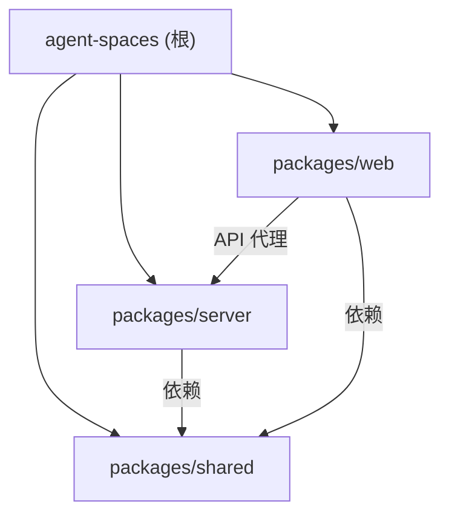

# Agent Spaces

## 项目愿景

Agent Spaces 是一个**本地多 Agent 协同编程平台**。用户在本地创建工作空间（Workspace），绑定代码目录，通过可视化 Workflow 编辑器（DAG 拓扑）编排 Agent 执行流程，或直接通过频道聊天 @mention Agent 触发执行。支持六种 Agent 角色（agent / scheduler / task_creator / bot / 以及自定义 role），四种 Agent 运行时（OpenAgentSdk / ClaudeCode / Codex / LangChain），前端提供 IDE 级别的集成开发环境体验，包含代码编辑器、终端、频道聊天、Git 操作、议题管理、工作流可视化编排、用量统计仪表盘、订阅余额管理、语音识别、快捷命令、命令面板、i18n 中英文切换等核心功能。支持通过飞书/企业微信 Bot 接收 Issue 状态通知并远程操控 Agent。

## 架构总览

- **项目类型**：pnpm monorepo（3 个包）
- **前端**：Next.js 16 (App Router) + TailwindCSS 4 + shadcn/ui + FlexLayout + Zustand + Monaco Editor + xterm.js + TipTap 富文本编辑器 + @xyflow/react (DAG 可视化) + next-intl (i18n) + cmdk (Command Palette)
- **后端**：Express 5 + WebSocket (ws) + node-pty + simple-git + node:sqlite (SQLite) + zod
- **共享层**：TypeScript 类型定义包，前后端共用
- **数据存储**：JSON 文件持久化（`~/.agent-spaces-data/`）+ SQLite（Agent Session 与 Usage 统计），无外部数据库
- **认证系统**：基于 Secret Key 的 Bearer Token 认证，全局中间件保护 API + WebSocket 连接
- **Agent 运行时**：支持四种运行时 -- `OpenAgentSdkRuntime`（基于 @codeany/open-agent-sdk）、`ClaudeCodeRuntime`（基于 @anthropic-ai/claude-agent-sdk，已拆分为 7 文件子模块）、`CodexRuntime`（基于 @openai/codex-sdk）、`LangChainRuntime`（基于 langchain），通过工厂函数 `createAgentRuntime()` 按配置切换
- **Anthropic Bridge**：ClaudeCodeRuntime 内置 Anthropic Messages 到 OpenAI Chat Completions/Responses 的协议中转，支持通过 Claude Code SDK 调用非 Anthropic 模型
- **通知中心 (Notification Hub)**：支持飞书（Lark）和企业微信（WeChat）和 Native（Tauri/Browser）三种外部通知渠道，Issue/Task 状态变更自动推送，支持 Bot Agent 远程对话和内置斜杠命令；另有应用内通知系统（NotificationCenter + NotificationType）
- **工作流系统 (Workflow)**：DAG 可视化模板编辑器（@xyflow/react），每个节点绑定具体 Agent Preset，Issue 选择 Workflow 后自动映射为 Task 执行，替代旧硬编码 pipeline
- **用量统计与计费**：SQLite 存储 Agent 每次执行的 Token 用量和费用估算，首页 Dashboard 展示趋势图和按模型统计
- **订阅管理 (Subscription)**：支持智谱 (ZhiPu)、MiniMax、AI Code 三种供应商的余额/配额查询，首页展示订阅面板
- **语音识别 (Speech Recognition)**：腾讯语音实时识别（WebSocket 流式），前端 useSpeechRecognition Hook 集成到聊天输入
- **快捷命令 (Quick Commands)**：自定义命令 CRUD + 运行/停止/自动重启，前端终端集成
- **代码搜索 (Code Search)**：ripgrep 优先 + Node.js 回退，支持正则/文件模式/大小写选项
- **Agent SSE API**：HTTP Server-Sent Events 流式 Agent 调用，无需 WebSocket，支持外部集成
- **Command Palette**：Ctrl+K 快捷命令面板（cmdk），全局搜索（工作空间/频道/Issue/文件/服务器）
- **多服务器支持**：前端支持配置和切换多个后端服务器实例
- **i18n 国际化**：next-intl + LocaleProvider，中英文切换，52 个组件已完成改造
- **Tauri 集成**：Zoom Wrapper + Native Notification + 静态路由适配

### 技术栈

| 层级 | 技术 | 版本 |
|------|------|------|
| 运行时 | Node.js | >= 20 |
| 包管理 | pnpm | >= 9 |
| 语言 | TypeScript | 5.8+ |
| 前端框架 | Next.js | 16.2 |
| UI 库 | shadcn/ui (base-nova) + TailwindCSS 4 | - |
| 布局引擎 | FlexLayout React | 0.9 |
| DAG 编辑器 | @xyflow/react | 12.10 |
| DAG 布局 | @dagrejs/dagre | 3.0 |
| 状态管理 | Zustand | 5 |
| 代码编辑 | Monaco Editor | 4.7 |
| 终端 | xterm.js (@xterm/xterm) | 6 |
| 富文本编辑 | TipTap (含 mention、placeholder 扩展) | 3.22 |
| i18n | next-intl | 4.11 |
| Command Palette | cmdk | 1.1 |
| 后端框架 | Express | 5 |
| WebSocket | ws | 8 |
| PTY | node-pty | 1.1 |
| Git 操作 | simple-git | 3.36 |
| 数据库 | node:sqlite (SQLite) | 内置 |
| Schema 校验 | zod | 4 |
| Agent SDK 1 | @codeany/open-agent-sdk | ^0.2.1 |
| Agent SDK 2 | @anthropic-ai/claude-agent-sdk | ^0.2.126 |
| Agent SDK 3 | @openai/codex-sdk | ^0.128.0 |
| Agent SDK 4 | langchain + @langchain/openai + @langchain/anthropic + @langchain/google-genai | ^1.4.0 |
| 飞书 SDK | @larksuiteoapi/node-sdk | ^1.62.1 |
| 图表 | Recharts | 3.8 |
| 表格 | @tanstack/react-table | ^8.21.3 |

## 模块结构图



## 模块索引

| 模块 | 路径 | 语言 | 文件数 | 职责 |
|------|------|------|--------|------|
| shared | `packages/shared` | TypeScript | 18 | 前后端共享类型定义（Workspace, Issue, IssueComment, Task, Agent, AgentUsageRecord, AgentUsageDashboard, Channel, Message, MessagePart, Event, File, Git, LLM, Tool, Workflow, Command, Subscription, Search, Notification, Speech） |
| server | `packages/server` | TypeScript | 106 | Express REST API + WebSocket 服务 + 认证中间件 + 四运行时 Agent 编排（OpenAgentSdk/ClaudeCode/Codex/LangChain） + Workflow 系统（DAG 校验/CRUD/Task 映射/运行时校验） + 通知中心（飞书/企微/Native Bot） + 应用内通知 + PTY 终端 + Git 操作 + SQLite Agent Usage + JSON 持久化 + LLM 管理 + Agent Preset + Function Call Tools + Anthropic Bridge + Issue 评论 + 工具详情持久化 + Commit Agent + 用量 Dashboard API + 文件夹浏览 + Git Clone SSE + Agent SSE API + 代码搜索 + 订阅管理（智谱/MiniMax/AICode） + 语音识别（腾讯） + 快捷命令 + Agent Designer + Skill/MCP 管理 + 用户设置 + zod 校验 |
| web | `packages/web` | TypeScript/TSX | 215 | Next.js 前端 SPA，包含登录页、工作空间管理、代码编辑器（Monaco Model 缓存 + 搜索面板 + 导入文件对话框）、终端（快捷命令 + 虚拟键盘 + 命令侧边栏）、结构化 AI 消息渲染、TipTap 富文本聊天 + @mention、语音识别输入、议题管理（含 Workflow 选择）、Workflow 可视化编辑器（@xyflow/react DAG + @dagrejs/dagre 自动布局）、Git 面板（含 Git 设置表单）、Agent 配置、LLM 管理、头像上传、用量统计仪表盘、订阅余额面板、项目设置面板（通知配置+Prompt配置）、服务器切换器、文件夹选择器、移动端适配、i18n 中英文切换（52 组件已改造）、Native 通知（Tauri/Browser）、Command Palette（Ctrl+K）、Iframe Tab 管理器、浮动控制台面板、Viewport 适配、Zoom 缩放、独立设置页（Agents/Skills/MCPs/Models/Providers）、通知中心对话框 |

## 运行与开发

```bash
# 安装依赖
pnpm install

# 并行启动 server + web（开发模式）
pnpm dev
# server: http://localhost:3100
# web:    http://localhost:3000（自动代理 /api/* 和 /ws 到 server）

# 构建
pnpm build

# Docker 构建
pnpm build:docker

# 清理
pnpm clean
```

### 环境变量

| 变量 | 默认值 | 说明 |
|------|--------|------|
| `PORT` | `3100` | 后端服务端口 |
| `HOST` | `0.0.0.0` | 后端服务监听地址 |
| `AGENT_SPACES_DATA_DIR` | `~/.agent-spaces-data` | 数据存储目录 |
| `ANTHROPIC_API_KEY` | - | ClaudeCodeRuntime 使用的 API Key |
| `ANTHROPIC_BASE_URL` | - | ClaudeCodeRuntime 使用的 API Base URL |
| `CLAUDE_CODE_MODEL` | - | Claude Code SDK 覆盖模型名（仅 Anthropic Bridge 模式） |
| `NEXT_PUBLIC_WS_PORT` | `3100` | 前端 WebSocket 连接端口 |
| `CODEX_API_KEY` / `OPENAI_API_KEY` | - | CodexRuntime 使用的 API Key |
| `CODEX_HOME` | - | Codex 配置目录（默认每个 agent 独立） |
| `SERVER_URL` | `http://localhost:3100` | 前端 SSR 时连接后端的 URL |
| `CORS_ORIGIN` | `*` | CORS 允许的来源 |

### 核心开发流程

1. 配置 Secret Key（`~/.agent-spaces-data/auth.json`）-> 登录页认证
2. 创建工作空间 -> 绑定本地目录（支持文件夹浏览器 + Git Clone SSE）-> 自动初始化 `.agentspace` 元数据目录
3. 配置 Agent Preset（角色、运行时类型、模型、API Key、MCP、技能、权限模式等）
4. 创建 Workflow 模板（可视化 DAG 编辑器，拖拽 Agent 节点，连线定义依赖）或使用已有模板
5. 创建议题（Issue）-> 可选择 Workflow 模板 -> 启动 Issue 自动化
6. Issue 自动化入口：若有 workflowId，加载 Workflow -> 映射为 Task -> 依赖调度执行 -> 全部 Task 完成后 Issue completed；若无 workflow，Issue 进入 error
7. 也可在频道聊天中 @mention Agent 直接触发执行，或使用 Agent SSE API（HTTP POST）外部调用
8. Agent 执行时实时展示 chain（工具调用/中间输出/最终结论）、工具详情（input/output/diff）、token 使用统计
9. 所有状态变更通过 WebSocket 实时推送到前端，同时触发通知中心事件
10. 首页 Dashboard 展示 Agent 用量趋势、Token 消耗、费用估算、按模型统计
11. 首页订阅面板展示智谱/MiniMax/AICode 余额和配额
12. 项目设置面板配置工作空间 Prompt、通知服务（飞书/企微）、Bot Agent
13. 设置面板中可切换中英文语言
14. 快捷命令面板（Ctrl+K）快速搜索和导航

## 测试策略

当前为 MVP 阶段，暂无自动化测试。规划中的测试策略：

- **后端单元测试**：services/storage 层的 CRUD 与状态转换
- **后端集成测试**：REST API + WebSocket 事件端到端
- **Workflow 系统测试**：DAG 校验（环检测/重复边/自环）、Task 映射、运行时校验
- **Agent 编排测试**：Workflow -> Task 映射 -> Agent 执行 -> Issue 状态流转
- **Agent 运行时测试**：OpenAgentSdkRuntime / ClaudeCodeRuntime / CodexRuntime / LangChainRuntime 的 execute/stop 行为
- **Anthropic Bridge 测试**：Anthropic Messages <-> OpenAI Chat/Responses 协议转换
- **Agent SSE API 测试**：HTTP SSE 流式调用、Key 认证、多消息格式
- **通知中心测试**：Lark/WeChat/Native Adapter 消息收发与命令处理
- **应用内通知测试**：NotificationCenter CRUD + WebSocket 推送
- **订阅管理测试**：ZhiPu/MiniMax/AICode 配额查询和错误处理
- **语音识别测试**：腾讯语音 WebSocket 流式会话
- **快捷命令测试**：CRUD + 运行/停止/自动重启
- **代码搜索测试**：ripgrep + Node.js 回退、正则/文件模式选项
- **认证中间件测试**：Token 验证与路由保护
- **前端组件测试**：关键 UI 组件的渲染与交互
- **Store 测试**：Zustand store 的状态变更逻辑
- **i18n 测试**：翻译 key 完整性、语言切换

## 编码规范

- TypeScript strict 模式，ESNext 模块
- 后端使用 ESM（`"type": "module"`）
- 前端使用 Next.js App Router + `"use client"` 指令
- 状态管理统一使用 Zustand（`create` 函数式写法）
- 组件使用函数式组件 + hooks
- CSS 使用 TailwindCSS utility classes
- UI 组件基于 shadcn/ui（base-nova 风格），参考 `packages/web/DESIGN.md` 设计规范
- API 路由按资源分组，遵循 RESTful 规范
- 认证使用 Bearer Token，除 `/api/health`、`/api/auth/login`、`/api/auth/check`、`/api/agent-sse/*` 外所有路由需认证
- Agent SSE API 支持三种认证方式：Bearer Token、`x-agent-spaces-key` Header、`key` Body 参数
- WebSocket 连接需 `token` 查询参数认证
- WebSocket 事件命名：`domain.action`（如 `terminal.create`, `agent.status_changed`, `workflow.created`, `command.started`）
- 数据持久化使用 JSON 文件（Workspace/Issue/Task/Channel/Message/LLM/Workflow/Command/Subscription/SpeechConfig/Notification）+ SQLite（Agent Session/Usage）
- Agent 编排使用 function-call tools（非 prompt-only），通过 `AgentFunctionTool` 抽象层统一管理
- 工具详情持久化到 `tool-details.json`，前端通过 API 懒加载
- ClaudeCodeRuntime 已从单文件拆分为子目录（7 文件），Bridge 使用引用计数式复用
- 通知中心使用 `BotAdapter` 接口抽象，新平台只需实现 start/stop/send/hasRecipients
- Workflow 使用 DAG 拓扑（@xyflow/react 前端 + 拓扑排序校验后端），替代旧硬编码 pipeline
- Agent Role 简化为 `agent | scheduler | task_creator | bot` + 自定义字符串，旧 role（planner/executor/reviewer/commit/custom）为兼容保留
- i18n 使用 next-intl，翻译文件 `src/locales/{en,zh}.json`，组件通过 `useTranslations()` 获取
- zod 用于后端请求校验
- 订阅管理使用 `SubscriptionProviderBase` 抽象，新供应商只需实现 fetchQuota
- 语音识别使用 `SpeechRecognitionProviderBase` 抽象，新供应商只需实现 createSession
- 快捷命令支持 autoRestart，通过 command-process-manager 管理生命周期
- 代码搜索优先使用系统 ripgrep，不可用时回退 Node.js 实现

## AI 使用指引

- 本项目使用了 `code-review-graph` MCP 工具，提供知识图谱能力
- `packages/web/AGENTS.md` 包含 Next.js 16 重要提示（Breaking Changes）
- `packages/web/DESIGN.md` 包含 UI 设计规范（MiniMax 风格参考）
- `.agentspace/claude.md` 为工作空间级知识库
- `docs/agent-lifecycle.md` 详细描述 Agent Preset 的创建、更新、导入和运行时行为
- `docs/issue-agent-automation.md` 详细描述 Issue 自动化编排链路（Scheduler -> Planner -> TaskCreator -> Executor -> Reviewer）
- `docs/workflow-system.md` 详细描述 Workflow 系统架构、数据模型、执行语义、修改指南
- `docs/codex-runtime-limitations.md` 记录 Codex 运行时的已知限制与解决方法
- `docs/anthropic-bridge.md` 说明 Anthropic Messages 到 OpenAI 的协议中转机制
- `docs/function-call-tools.md` 描述 Agent Function Call 工具层
- `docs/ai-message-rendering.md` 描述 AI 消息的结构化渲染链路
- `docs/model-usage-accounting.md` 详细描述 Token 用量统计、费用计算和 Dashboard 展示流程
- `docs/bot-notification-workflow.md` 详细描述飞书/企微 Bot 通知系统架构、命令系统和扩展指南
- `docs/superpowers/specs/2026-05-06-i18n-design.md` i18n 中英文多语言切换设计文档
- `docs/superpowers/specs/2026-05-07-workflow-visual-editor-design.md` Workflow 可视化编辑器设计文档
- `docs/superpowers/specs/2026-05-08-quick-command-design.md` 快捷命令设计文档（**新**）
- `docs/superpowers/specs/2026-05-14-editor-search-and-monaco-models-design.md` 编辑器搜索和 Monaco Models 设计文档（**新**）
- 项目规划文件：`PRD.md`（需求文档）

## MCP Tools: code-review-graph

**IMPORTANT: This project has a knowledge graph. ALWAYS use the
code-review-graph MCP tools BEFORE using Grep/Glob/Read to explore
the codebase.** The graph is faster, cheaper (fewer tokens), and gives
you structural context (callers, dependents, test coverage) that file
scanning cannot.

### When to use graph tools FIRST

- **Exploring code**: `semantic_search_nodes` or `query_graph` instead of Grep
- **Understanding impact**: `get_impact_radius` instead of manually tracing imports
- **Code review**: `detect_changes` + `get_review_context` instead of reading entire files
- **Finding relationships**: `query_graph` with callers_of/callees_of/imports_of/tests_for
- **Architecture questions**: `get_architecture_overview` + `list_communities`

Fall back to Grep/Glob/Read **only** when the graph doesn't cover what you need.

### Key Tools

| Tool | Use when |
|------|----------|
| `detect_changes` | Reviewing code changes -- gives risk-scored analysis |
| `get_review_context` | Need source snippets for review -- token-efficient |
| `get_impact_radius` | Understanding blast radius of a change |
| `get_affected_flows` | Finding which execution paths are impacted |
| `query_graph` | Tracing callers, callees, imports, tests, dependencies |
| `semantic_search_nodes` | Finding functions/classes by name or keyword |
| `get_architecture_overview` | Understanding high-level codebase structure |
| `refactor_tool` | Planning renames, finding dead code |

### Workflow

1. The graph auto-updates on file changes (via hooks).
2. Use `detect_changes` for code review.
3. Use `get_affected_flows` to understand impact.
4. Use `query_graph` pattern="tests_for" to check coverage.

## 变更记录 (Changelog)

| 时间 | 操作 | 说明 |
|------|------|------|
| 2026-05-16T17:36:40+08:00 | 增量更新 | **第四运行时 LangChain**（新增 langchain-runtime.ts，基于 langchain + @langchain/openai + @langchain/anthropic + @langchain/google-genai，provider-neutral createAgent API）；**订阅管理系统**（shared 新增 subscription.ts 类型，server 新增 services/subscription/ 目录 5 文件 + storage/subscription-store.ts + routes/subscription.ts，支持智谱/MiniMax/AICode 三供应商配额查询，web 新增 home/subscription-panel.tsx + home/subscription-dialog.tsx）；**语音识别**（shared 新增 speech.ts 类型，server 新增 services/speech-recognition/ 目录 3 文件 + storage/speech-recognition-store.ts + routes/speech-recognition.ts + /ws/speech WebSocket 端点，腾讯语音实时识别，web 新增 hooks/use-speech-recognition.ts）；**快捷命令**（shared 新增 command.ts 类型，server 新增 services/command.ts + services/command-process-manager.ts + storage/command-store.ts + routes/command.ts，CRUD + 运行/停止/自动重启，web 新增 stores/command.ts + components/terminal/command-dialog.tsx + command-sidebar.tsx + import-commands-dialog.tsx + terminal-toolbar.tsx + terminal-utils.ts + virtual-keyboard.tsx）；**代码搜索**（shared 新增 search.ts 类型，server 新增 services/search.ts + services/gitignore.ts + routes/search.ts，ripgrep 优先 + Node.js 回退，web 新增 components/editor/search-panel.tsx + stores/search-commands/ 目录 6 文件）；**Agent SSE API**（server 新增 routes/agent-sse.ts，HTTP POST /api/agent-sse/run，SSE 流式 Agent 调用，支持外部集成）；**Agent Designer**（server 新增 agents/agent-designer.ts，AI 自动生成 Agent 预设配置）；**应用内通知**（shared 新增 notification.ts 类型 + events.ts 新增 notification.created/cleared 事件，server 新增 services/notification-center.ts + routes/notification.ts，web 新增 stores/notification.ts + components/sidebar/notification-center-dialog.tsx + components/sidebar/nav-notifications.tsx）；**Skill/MCP 管理**（server 新增 routes/skill.ts + services/skill.ts + routes/mcp.ts + services/mcp.ts，全局 Skill/MCP CRUD + 导入 + 同步，web 新增 components/sidebar/skills-dialog.tsx + mcps-dialog.tsx + app/settings/skills/ + app/settings/mcps/）；**用户设置**（server 新增 storage/user-settings-store.ts + GET/PUT /api/user/settings，web 新增 hooks/use-user-avatar.ts）；**独立设置页**（web 新增 app/settings/layout.tsx + page.tsx + agents/page.tsx + models/page.tsx + providers/page.tsx + skills/page.tsx + mcps/page.tsx + components/settings/settings-page-layout.tsx）；**Command Palette**（web 新增 stores/command-palette.ts + components/command-palette.tsx + components/ui/command.tsx + components/ui/navigation-menu.tsx，Ctrl+K 快捷面板）；**Iframe 管理**（web 新增 stores/iframe-tabs.ts + components/common/iframe-manager.tsx，嵌入式网页 Tab + 浮球 + 链接拦截）；**编辑器增强**（web 新增 components/editor/import-file-dialog.tsx + lib/monaco-models.ts Model 缓存预加载 + components/editor/search-panel.tsx）；**终端增强**（web terminal 组件 4->8）；**Git 增强**（web 新增 components/git/git-settings-form.tsx 替代旧 git-graph-panel.tsx）；**UI 增强**（web 新增 components/common/console-panel.tsx + components/common/member-picker.tsx + components/common/iframe-manager.tsx + components/ui/file-upload.tsx + components/ui/input-group.tsx + components/viewport-insets.tsx + components/zoom-wrapper.tsx）；**导航增强**（web 新增 lib/routes.ts + lib/navigate.ts + lib/api-polyfill.ts）；**WS 重构**（server ws/handler.ts @mention 逻辑提取到 ws/agent-runner.ts + ws/message-parts.ts + ws/agent-prompt.ts）；**server 版本 0.2.4->0.3.0**；**新增依赖** langchain + @langchain/openai + @langchain/anthropic + @langchain/google-genai + cmdk + @dnd-kit/react + @base-ui/react + @emotion/is-prop-valid；**shared 13->18、server 73->106、web 168->215** |
| 2026-05-08T17:18:31+08:00 | 增量更新 | **Workflow 系统**（可视化 DAG 编辑器，@xyflow/react + @dagrejs/dagre 自动布局，shared/workflow.ts 新增 WorkflowTemplate/WorkflowNode/WorkflowEdge 类型，server 新增 workflow-store + workflow service（DAG 校验/role 解析/Task 映射/运行时校验）+ workflow route，web 新增 workflow-editor/canvas/agent-node/agent-palette/toolbar/mini-preview/list 组件 + workflow-templates-dialog + workflows-page + workflow store + /workflows 页面路由）；**Agent Role 重构**（BuiltInAgentRole 简化为 `agent \| scheduler \| task_creator \| bot`，旧 role 兼容但不再是公开枚举）；**Issue 自动化重构**（issue-agent-runner 不再回退旧 hardcoded pipeline，无 workflow 时直接 error）；**i18n 中英文切换**（next-intl + LocaleProvider + src/locales/{en,zh}.json，52 个组件完成改造，settings-dialog 新增 Language 选择器）；**Native 通知**（native-notification.ts 抽象层，支持 Tauri + Browser Notification API）；**新增依赖**（@xyflow/react + @dagrejs/dagre + next-intl + zod）；**新增 WebSocket 事件**（workflow.created/updated/deleted）；**新增文档**（workflow-system.md + i18n-design.md + workflow-visual-editor-design.md）；**server 文件数 70->73、shared 12->13、web 141->168** |
| 2026-05-05T23:52:43+08:00 | 增量更新 | 认证系统（Secret Key + Bearer Token + auth middleware）、通知中心 Notification Hub（飞书 Lark/企微 WeChat 双适配器 + Bot Agent + 16 个内置斜杠命令 + QR Code 登录）、Commit Agent（自动生成 conventional commit message）、Issue 自动化重构（issue-agent-runner + issue-retry 启动恢复）、ClaudeCodeRuntime 拆分为 7 文件子模块（index/sdk-config/adapter-pool/anthropic-bridge/protocol-converter/message-format/types）、Agent Usage Dashboard（SQLite 存储 + 费用估算 + 首页图表）、新增 API 路由（auth/folder/notifications/wechat-qr/clone/prompt/usage-dashboard）、前端新增（登录页/工作空间管理页/服务器切换器/项目设置面板/用量仪表盘/文件夹选择器/auth-guard/app-shell/移动端 tab bar）、shared 新增类型（AgentUsageRecord/AgentUsageDashboard/WorkspaceNotificationSettings/LLMModelCost/NotificationProvider）、2 篇新文档（model-usage-accounting.md + bot-notification-workflow.md）、AgentConfig role 新增 commit/bot、Docker 构建优化、依赖新增 @larksuiteoapi/node-sdk + @tanstack/react-table + date-fns + sonner + react-day-picker |
| 2026-05-04T21:04:42+08:00 | 增量更新 | 三运行时架构（新增 CodexRuntime + @openai/codex-sdk）、Anthropic Bridge 协议中转、Issue 自动化编排链路（TaskCreator + 依赖调度 + IssueComment + AgentProgress）、Function Call Tools 内置工具层、结构化 AI 消息渲染（MessagePart/chain/tool-detail/diff）、AgentConfig 大幅扩展（codex/avatarUrl/sandboxDirs/maxRetries/tools/permissionMode）、前端 agent store、5 篇新文档 |
| 2026-05-02T23:43:41 | 增量更新 | 补充双运行时架构、LLM 管理、Agent Preset 系统、TipTap 富文本编辑、mention 触发、DESIGN.md 规范、docs/agent-lifecycle.md 等新发现 |
| 2026-05-02T01:07:33 | 初始化 | init-architect 首次扫描生成根级与模块级 CLAUDE.md |
