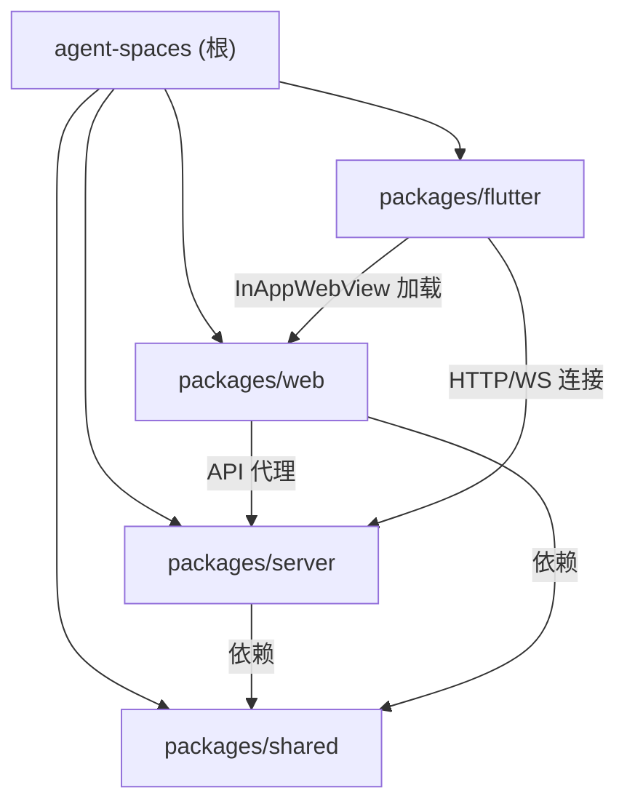

# Agent Spaces

## 项目愿景

Agent Spaces 是一个**本地多 Agent 协同编程平台**。用户在本地创建工作空间（Workspace），绑定代码目录，通过可视化 Workflow 编辑器（DAG 拓扑）编排 Agent 执行流程，或直接通过频道聊天 @mention Agent 触发执行。支持六种 Agent 角色（agent / scheduler / task_creator / bot / 以及自定义 role），四种 Agent 运行时（OpenAgentSdk / ClaudeCode / Codex / LangChain），前端提供 IDE 级别的集成开发环境体验，包含代码编辑器（Monaco + TypeScript LSP 实时类型检查/定义跳转/引用查找）、终端、频道聊天、Git 操作、议题管理、工作流可视化编排、用量统计仪表盘、订阅余额管理、语音识别、快捷命令、命令面板、代码收藏、Prompt 模板管理、Hook 系统（Agent 工具调用前后自定义钩子）、输出风格管理、DOM Inspector 源码定位、i18n 中英文切换、Kanban 看板管理、Notion 风格文档数据库等核心功能。支持通过飞书/企业微信 Bot 接收 Issue 状态通知并远程操控 Agent。

## 架构总览

- **项目类型**：pnpm monorepo（3 个包）+ Flutter 客户端（独立 pubspec）
- **前端**：Next.js 16 (App Router) + TailwindCSS 4 + shadcn/ui + FlexLayout + Zustand + Monaco Editor（含 TypeScript LSP 语言客户端）+ xterm.js + TipTap 富文本编辑器 + @xyflow/react (DAG 可视化) + next-intl (i18n) + cmdk (Command Palette)
- **移动端/桌面端**：Flutter 3.10 + Riverpod + InAppWebView + GoRouter + awesome_notifications + docking，内嵌 Web 前端的多平台原生壳应用
- **后端**：Express 5 + WebSocket (ws) + node-pty + simple-git + node:sqlite (SQLite) + zod
- **共享层**：TypeScript 类型定义包，前后端共用
- **数据存储**：JSON 文件持久化（`~/.agent-spaces-data/`）+ SQLite（Agent Session/Usage 统计 + Kanban Board + DocNode 文档数据库），无外部数据库
- **认证系统**：基于 Secret Key 的 Bearer Token 认证，全局中间件保护 API + WebSocket 连接
- **Agent 运行时**：支持四种运行时 -- `OpenAgentSdkRuntime`（基于 @codeany/open-agent-sdk）、`ClaudeCodeRuntime`（基于 @anthropic-ai/claude-agent-sdk，已拆分为 7 文件子模块）、`CodexRuntime`（基于 @openai/codex-sdk）、`LangChainRuntime`（基于 langchain），通过工厂函数 `createAgentRuntime()` 按配置切换
- **Anthropic Bridge**：ClaudeCodeRuntime 内置 Anthropic Messages 到 OpenAI Chat Completions/Responses 的协议中转，支持通过 Claude Code SDK 调用非 Anthropic 模型
- **持久上下文**：`persistent-agent-context.ts` 自动加载工作空间中的 CLAUDE.md/AGENTS.md 指令文件和 Workspace Prompt，注入所有 Agent 运行时（聊天/Issue/SSE/Bot）
- **Hook 系统**：Agent 工具调用前后的自定义钩子系统，支持 shell command/webhook/script 三种动作类型，per-tool-call 粒度，工作空间级别 `.hook.json` 文件存储，通过 `wrapOnEventWithHooks()` 拦截 `AgentRuntimeEvent`
- **输出风格管理**：自定义 Agent 输出格式模板（Markdown），按工作空间持久化，Agent 运行时通过 `resolveOutputStyleContent()` 注入 systemPrompt
- **通知中心 (Notification Hub)**：支持飞书（Lark）和企业微信（WeChat）和 Native（Tauri/Browser）三种外部通知渠道，Issue/Task 状态变更自动推送，支持 Bot Agent 远程对话和内置斜杠命令；另有应用内通知系统（NotificationCenter + NotificationType）
- **工作流系统 (Workflow)**：DAG 可视化模板编辑器（@xyflow/react），每个节点绑定具体 Agent Preset，Issue 选择 Workflow 后自动映射为 Task 执行，替代旧硬编码 pipeline
- **Kanban 看板**：工作空间级看板管理（SQLite 存储），支持多列拖拽排序（@dnd-kit）、任务 CRUD、水平/垂直布局切换、优先级筛选、搜索过滤
- **文档数据库 (Database)**：Notion 风格的树形文档系统（SQLite 存储），支持创建/移动/软删除/恢复、Notion 编辑器 + Markdown 编辑器双模式、封面/图标、快速搜索、回收站、多标签页
- **用量统计与计费**：SQLite 存储 Agent 每次执行的 Token 用量和费用估算，首页 Dashboard 展示趋势图和按模型统计
- **订阅管理 (Subscription)**：支持智谱 (ZhiPu)、MiniMax、AI Code 三种供应商的余额/配额查询，首页展示订阅面板
- **语音识别 (Speech Recognition)**：腾讯语音实时识别（WebSocket 流式），前端 useSpeechRecognition Hook 集成到聊天输入
- **快捷命令 (Quick Commands)**：自定义命令 CRUD + 运行/停止/自动重启，前端终端集成
- **代码搜索 (Code Search)**：ripgrep 优先 + Node.js 回退，支持正则/文件模式/大小写选项
- **代码收藏 (Code Favorites)**：Monaco 编辑器右键收藏代码位置/片段，侧面板查看/跳转/删除，按工作空间持久化
- **Prompt 模板管理**：CRUD + 应用到多个 Agent 预设，独立设置页 /settings/prompts
- **Agent SSE API**：HTTP Server-Sent Events 流式 Agent 调用，无需 WebSocket，支持外部集成
- **TypeScript LSP**：后端启动 typescript-language-server 子进程，前端 monaco-languageclient 通过 WebSocket 连接，提供定义跳转/引用/诊断等 TypeScript 语义能力
- **DOM Inspector**：基于 dom-inspector-hook 的元素源码定位，被调试项目 Alt+Shift 点击自动在编辑器中打开源文件
- **Command Palette**：Ctrl+K 快捷命令面板（cmdk），全局搜索（工作空间/频道/Issue/文件/服务器）
- **多服务器支持**：前端支持配置和切换多个后端服务器实例
- **i18n 国际化**：next-intl + LocaleProvider，中英文切换，52 个组件已完成改造
- **Tauri 集成**：Zoom Wrapper + Native Notification + 静态路由适配
- **Timeline**：版本发布时间线展示（v1.1.0 / v1.2.0 / v1.3.0）

### 技术栈

| 层级 | 技术 | 版本 |
|------|------|------|
| 运行时 | Node.js | >= 20 |
| 包管理 | pnpm | >= 9 |
| 语言 | TypeScript | 5.8+ |
| 前端框架 | Next.js | 16.2 |
| UI 库 | shadcn/ui (base-nova) + TailwindCSS 4 | - |
| 布局引擎 | FlexLayout React | 0.9 |
| DAG 编辑器 | @xyflow/react | 12.10 |
| DAG 布局 | @dagrejs/dagre | 3.0 |
| 状态管理 | Zustand | 5 |
| 代码编辑 | Monaco Editor | 4.7 |
| Monaco LSP 客户端 | monaco-languageclient | 10.7 |
| TypeScript LSP 服务端 | typescript-language-server | 5.2 |
| LSP 通信 | vscode-ws-jsonrpc | 3.5 |
| 终端 | xterm.js (@xterm/xterm) | 6 |
| 富文本编辑 | TipTap (含 mention、placeholder 扩展) | 3.22 |
| i18n | next-intl | 4.11 |
| Command Palette | cmdk | 1.1 |
| 后端框架 | Express | 5 |
| WebSocket | ws | 8 |
| PTY | node-pty | 1.1 |
| Git 操作 | simple-git | 3.36 |
| 数据库 | node:sqlite (SQLite) | 内置 |
| Schema 校验 | zod | 4 |
| Agent SDK 1 | @codeany/open-agent-sdk | ^0.2.1 |
| Agent SDK 2 | @anthropic-ai/claude-agent-sdk | ^0.2.126 |
| Agent SDK 3 | @openai/codex-sdk | ^0.128.0 |
| Agent SDK 4 | langchain + @langchain/openai + @langchain/anthropic + @langchain/google-genai | ^1.4.0 |
| 飞书 SDK | @larksuiteoapi/node-sdk | ^1.62.1 |
| 图表 | Recharts | 3.8 |
| 表格 | @tanstack/react-table | ^8.21.3 |
| 拖拽 | @dnd-kit/core + @dnd-kit/sortable | ^6.3.1 |
| 拖放面板 | react-resizable-panels | - |
| 移动端框架 | Flutter | ^3.10.1 |
| 移动端状态管理 | flutter_riverpod | ^2.6.1 |
| 移动端 WebView | flutter_inappwebview | ^6.1.5 |
| 移动端路由 | go_router | ^14.8.1 |
| 移动端通知 | awesome_notifications | ^0.11.0 |
| 移动端 Docking | docking | - |

## 模块结构图



## 模块索引

| 模块 | 路径 | 语言 | 文件数 | 职责 |
|------|------|------|--------|------|
| shared | `packages/shared` | TypeScript | 22 | 前后端共享类型定义（Workspace, Issue, IssueComment, Task, Agent, AgentUsageRecord, AgentUsageDashboard, Channel, Message, MessagePart, Event, File, Git, LLM, Tool, Workflow, Command, Subscription, Search, Notification, Speech, CodeFavorite, Hook, DocNode, KanbanBoard） |
| server | `packages/server` | TypeScript | 128 | Express REST API + WebSocket 服务 + 认证中间件 + 四运行时 Agent 编排（OpenAgentSdk/ClaudeCode/Codex/LangChain） + Workflow 系统（DAG 校验/CRUD/Task 映射/运行时校验） + Hook 系统（Agent 工具调用前后钩子 + shell/webhook/script 动作） + 输出风格管理（OutputStyle 模板 CRUD + 运行时注入） + 通知中心（飞书/企微/Native Bot） + 应用内通知 + PTY 终端 + Git 操作 + SQLite Agent Usage + Kanban Board（SQLite 看板管理） + DocNode 文档数据库（SQLite 树形文档系统） + JSON 持久化 + LLM 管理 + Agent Preset + Function Call Tools + Anthropic Bridge + Issue 评论与服务层 + 工具详情持久化 + Commit Agent + 用量 Dashboard API + 文件夹浏览 + Git Clone SSE + Agent SSE API + 代码搜索 + 订阅管理（智谱/MiniMax/AICode） + 语音识别（腾讯） + 快捷命令 + Agent Designer + Skill/MCP 管理 + Prompt 模板管理 + 代码收藏 + 持久上下文加载 + TypeScript LSP 服务 + DOM Inspector 端点 + zod 校验 |
| web | `packages/web` | TypeScript/TSX | 296 | Next.js 前端 SPA，包含登录页、工作空间管理、代码编辑器（Monaco + TypeScript LSP 定义跳转/引用/诊断 + Model 缓存 + 搜索面板 + 导入文件对话框 + 代码收藏面板 + Monaco Action Registry + 菜单栏 + 移动端适配）、终端（快捷命令 + 虚拟键盘 + 命令侧边栏）、结构化 AI 消息渲染（含 tool-step/context-panel/context-usage 组件）、TipTap 富文本聊天 + @mention + 回复 AI 消息工作流 + slash 命令 + agent resource 扩展、语音识别输入、议题管理（含 Workflow 选择 + 拖拽排序任务面板 + info panel）、Workflow 可视化编辑器（@xyflow/react DAG + @dagrejs/dagre 自动布局）、Git 面板（含设置表单 + commit diff viewer + context menu + discard 对话框 + 远程同步 Hook + commits panel）、频道管理（频道对话框 + 频道信息面板 + 成员管理）、Agent 配置、LLM 管理（模型 + 供应商对话框）、头像上传、用量统计仪表盘、订阅余额面板、项目设置面板（通知配置+Prompt配置+Git 配置+Speech 配置）、服务器切换器、文件夹选择器、移动端适配、i18n 中英文切换（52 组件已改造）、Native 通知（Tauri/Browser）、Command Palette（Ctrl+K）、Iframe Tab 管理器、浮动面板/浮球、Inspector 历史记录、独立设置页（Agents/Skills/MCPs/Models/Providers/Prompts/OutputStyles/Hooks）、通知中心对话框、Hook 管理对话框、输出风格管理对话框、DOM Inspector 集成、Providers 管理对话框、Kanban 看板（@dnd-kit 拖拽 + 水平/垂直布局）、Notion 风格文档数据库（树形导航 + Notion/Markdown 双编辑器 + 快速搜索 + 回收站）、版本发布时间线（Timeline）、Settings 对话框拆分（Appearance/Language/Account/Security/Git/Speech 6 个 Tab）、Agent Picker 对话框、Editor 增强（file-tree/file-icon/file-context-menu/editor-tabs/editor-panel） |
| flutter | `packages/flutter` | Dart | 26 | Flutter 多平台原生壳应用（Android/iOS/macOS/Windows/Web），内嵌 InAppWebView 加载 Web 前端，提供原生通知、设备模拟（Phone/Tablet/Desktop）、书签管理、内网服务器自动发现（/api/health 探测）、JS Bridge 双向通信（Flutter <-> WebView 事件+RPC）、控制台日志捕获、Tab 管理（docking 多窗口布局）、Split Layout、右键菜单、Tab 对话框、调试工具 |

## 运行与开发

```bash
# 安装依赖
pnpm install

# 并行启动 server + web（开发模式）
pnpm dev
# server: http://localhost:3100
# web:    http://localhost:3000（自动代理 /api/* 和 /ws 到 server）

# 构建
pnpm build

# Docker 构建
pnpm build:docker

# 清理
pnpm clean
```

### Flutter 客户端

```bash
cd packages/flutter

# 获取依赖
flutter pub get

# 运行（开发模式，需连接设备或模拟器）
flutter run

# 构建 APK
flutter build apk

# 构建 iOS
flutter build ios

# 构建 macOS
flutter build macos

# 运行测试
flutter test
```

### 环境变量

| 变量 | 默认值 | 说明 |
|------|--------|------|
| `PORT` | `3100` | 后端服务端口 |
| `HOST` | `0.0.0.0` | 后端服务监听地址 |
| `AGENT_SPACES_DATA_DIR` | `~/.agent-spaces-data` | 数据存储目录 |
| `ANTHROPIC_API_KEY` | - | ClaudeCodeRuntime 使用的 API Key |
| `ANTHROPIC_BASE_URL` | - | ClaudeCodeRuntime 使用的 API Base URL |
| `CLAUDE_CODE_MODEL` | - | Claude Code SDK 覆盖模型名（仅 Anthropic Bridge 模式） |
| `NEXT_PUBLIC_WS_PORT` | `3100` | 前端 WebSocket 连接端口 |
| `CODEX_API_KEY` / `OPENAI_API_KEY` | - | CodexRuntime 使用的 API Key |
| `CODEX_HOME` | - | Codex 配置目录（默认每个 agent 独立） |
| `SERVER_URL` | `http://localhost:3100` | 前端 SSR 时连接后端的 URL |
| `CORS_ORIGIN` | `*` | CORS 允许的来源 |

### 核心开发流程

1. 配置 Secret Key（`~/.agent-spaces-data/auth.json`）-> 登录页认证
2. 创建工作空间 -> 绑定本地目录（支持文件夹浏览器 + Git Clone SSE）-> 自动初始化 `.agentspace` 元数据目录
3. 配置 Agent Preset（角色、运行时类型、模型、API Key、MCP、技能、权限模式等）
4. 创建 Workflow 模板（可视化 DAG 编辑器，拖拽 Agent 节点，连线定义依赖）或使用已有模板
5. 创建议题（Issue）-> 可选择 Workflow 模板 -> 启动 Issue 自动化
6. Issue 自动化入口：若有 workflowId，加载 Workflow -> 映射为 Task -> 依赖调度执行 -> 全部 Task 完成后 Issue completed；若无 workflow，Issue 进入 error
7. 也可在频道聊天中 @mention Agent 直接触发执行，或使用 Agent SSE API（HTTP POST）外部调用
8. Agent 执行时实时展示 chain（工具调用/中间输出/最终结论）、工具详情（input/output/diff）、token 使用统计
9. 所有状态变更通过 WebSocket 实时推送到前端，同时触发通知中心事件
10. 首页 Dashboard 展示 Agent 用量趋势、Token 消耗、费用估算、按模型统计
11. 首页订阅面板展示智谱/MiniMax/AICode 余额和配额
12. 项目设置面板配置工作空间 Prompt、通知服务（飞书/企微）、Bot Agent
13. 设置面板中可切换中英文语言
14. 快捷命令面板（Ctrl+K）快速搜索和导航
15. Flutter 客户端：启动后自动扫描内网发现服务器 -> InAppWebView 加载 Web 前端 -> JS Bridge 提供原生通知/设备模拟等增强能力
16. 代码收藏：Monaco 编辑器右键"添加到代码收藏"，收藏面板查看/跳转/删除
17. Prompt 模板：在 /settings/prompts 页面管理 Prompt 模板，可批量应用到多个 Agent 预设
18. TypeScript LSP：工作空间打开时自动启动 TypeScript Language Server，Monaco 编辑器提供定义跳转/引用/诊断
19. DOM Inspector：被调试项目中 Alt+Shift 点击元素，自动在 Agent Spaces 编辑器中打开对应源文件
20. Hook 系统：在 /settings/hooks 或侧边栏 Hooks 对话框管理 Hook（CRUD + 上传 JSON + Monaco 编辑器），Agent 工具调用前后自动触发
21. 输出风格：在 /settings/output-styles 或侧边栏 Output Styles 对话框管理输出格式模板，应用到 Agent systemPrompt
22. Kanban 看板：工作空间内拖拽式看板管理，支持多列、优先级、搜索过滤、水平/垂直布局切换
23. 文档数据库：Notion 风格的树形文档系统，支持 Notion/Markdown 双编辑器、封面、图标、回收站

## 测试策略

当前为 MVP 阶段，暂无自动化测试。规划中的测试策略：

- **后端单元测试**：services/storage 层的 CRUD 与状态转换
- **后端集成测试**：REST API + WebSocket 事件端到端
- **Workflow 系统测试**：DAG 校验（环检测/重复边/自环）、Task 映射、运行时校验
- **Agent 编排测试**：Workflow -> Task 映射 -> Agent 执行 -> Issue 状态流转
- **Agent 运行时测试**：OpenAgentSdkRuntime / ClaudeCodeRuntime / CodexRuntime / LangChainRuntime 的 execute/stop 行为
- **Anthropic Bridge 测试**：Anthropic Messages <-> OpenAI Chat/Responses 协议转换
- **Agent SSE API 测试**：HTTP SSE 流式调用、Key 认证、多消息格式
- **Hook 系统测试**：hook-engine 规则匹配、命令执行、wrapOnEventWithHooks 拦截
- **输出风格测试**：CRUD + resolveOutputStyleContent 注入
- **Kanban 测试**：SQLite 存储 CRUD + 拖拽排序 + 布局切换
- **文档数据库测试**：DocNode 树形结构 CRUD + 移动 + 软删除/恢复 + 搜索
- **通知中心测试**：Lark/WeChat/Native Adapter 消息收发与命令处理
- **应用内通知测试**：NotificationCenter CRUD + WebSocket 推送
- **订阅管理测试**：ZhiPu/MiniMax/AICode 配额查询和错误处理
- **语音识别测试**：腾讯语音 WebSocket 流式会话
- **快捷命令测试**：CRUD + 运行/停止/自动重启
- **代码搜索测试**：ripgrep + Node.js 回退、正则/文件模式选项
- **代码收藏测试**：CRUD + 按工作空间持久化
- **Prompt 模板测试**：CRUD + 批量应用到 Agent
- **持久上下文测试**：CLAUDE.md/AGENTS.md 自动加载 + 截断预算
- **TypeScript LSP 测试**：WebSocket 连接/断开、typescript-language-server 子进程管理
- **认证中间件测试**：Token 验证与路由保护
- **前端组件测试**：关键 UI 组件的渲染与交互
- **Store 测试**：Zustand store 的状态变更逻辑
- **i18n 测试**：翻译 key 完整性、语言切换
- **Flutter Provider 测试**：BrowserNotifier/BookmarkNotifier/SettingsNotifier 状态变更
- **Flutter JsBridge 测试**：事件收发、RPC 调用、Promise 回调
- **Flutter Widget 测试**：TabBar 交互、BookmarksScreen CRUD 对话框

## 编码规范

- TypeScript strict 模式，ESNext 模块
- 后端使用 ESM（`"type": "module"`）
- 前端使用 Next.js App Router + `"use client"` 指令
- 状态管理统一使用 Zustand（`create` 函数式写法）
- 组件使用函数式组件 + hooks
- CSS 使用 TailwindCSS utility classes
- UI 组件基于 shadcn/ui（base-nova 风格），参考 `packages/web/DESIGN.md` 设计规范
- API 路由按资源分组，遵循 RESTful 规则
- 认证使用 Bearer Token，除 `/api/health`、`/api/auth/login`、`/api/auth/check`、`/api/agent-sse/*`、`/api/inspector/track` 外所有路由需认证
- Agent SSE API 支持三种认证方式：Bearer Token、`x-agent-spaces-key` Header、`key` Body 参数
- DOM Inspector `/api/inspector/track` 免认证（被调试项目调用）
- WebSocket 连接需 `token` 查询参数认证
- WebSocket 事件命名：`domain.action`（如 `terminal.create`, `agent.status_changed`, `workflow.created`, `command.started`, `inspector.jump`）
- 数据持久化使用 JSON 文件（Workspace/Issue/Task/Channel/Message/LLM/Workflow/Command/Subscription/SpeechConfig/Notification/CodeFavorites/PromptTemplates/Hooks/OutputStyles）+ SQLite（Agent Session/Usage + Kanban Board + DocNode Database）
- Agent 编排使用 function-call tools（非 prompt-only），通过 `AgentFunctionTool` 抽象层统一管理
- 工具详情持久化到 `tool-details.json`，前端通过 API 懒加载
- ClaudeCodeRuntime 已从单文件拆分为子目录（7 文件），Bridge 使用引用计数式复用
- 持久上下文通过 `persistent-agent-context.ts` 自动加载，支持 CLAUDE.md/AGENTS.md 层级优先级和字符预算截断
- Hook 系统通过 `wrapOnEventWithHooks()` 拦截 AgentRuntimeEvent，支持 PreToolUse/PostToolUse 阶段，shell command/webhook/script 三种动作，`.hook.json` 文件存储在工作空间 hooks 目录
- 输出风格通过 `resolveOutputStyleContent()` 注入 Agent systemPrompt，OutputStyleTemplate 类型，meta.json 持久化
- 通知中心使用 `BotAdapter` 接口抽象，新平台只需实现 start/stop/send/hasRecipients
- Workflow 使用 DAG 拓扑（@xyflow/react 前端 + 拓扑排序校验后端），替代旧硬编码 pipeline
- Agent Role 简化为 `agent | scheduler | task_creator | bot` + 自定义字符串，旧 role（planner/executor/reviewer/commit/custom）为兼容保留
- i18n 使用 next-intl，翻译文件 `src/locales/{en,zh}.json`，组件通过 `useTranslations()` 获取
- zod 用于后端请求校验
- 订阅管理使用 `SubscriptionProviderBase` 抽象，新供应商只需实现 fetchQuota
- 语音识别使用 `SpeechRecognitionProviderBase` 抽象，新供应商只需实现 createSession
- 快捷命令支持 autoRestart，通过 command-process-manager 管理生命周期
- 代码搜索优先使用系统 ripgrep，不可用时回退 Node.js 实现
- 代码收藏使用 CodeFavorite 类型（path/line/column/endLine/endColumn/label/snippet），按工作空间 JSON 持久化
- Prompt 模板使用 PromptTemplate 类型（name/content），meta.json 持久化，支持批量 apply 到 Agent
- Monaco Action Registry 模式：`registerMonacoAction()` 注册自定义右键菜单/快捷键，`applyRegisteredActions()` 批量应用到编辑器实例
- TypeScript LSP：后端 typescript-language-server --stdio + vscode-ws-jsonrpc 转发，前端 monaco-languageclient 消费
- Kanban 使用 SQLite 存储（kanban_boards/kanban_columns/kanban_tasks 三表），前端 @dnd-kit 拖拽排序
- 文档数据库使用 SQLite 存储（doc_nodes 单表 + parent_id 树形），前端 Notion/Markdown 双编辑器 + ResizablePanel 布局
- Flutter 客户端使用 Riverpod StateNotifier 模式，Widget 用 ConsumerWidget/ConsumerStatefulWidget
- Flutter 数据模型使用 copyWith 不可变模式，持久化通过 StorageService 静态方法
- Flutter Web 前端通过 `window.isFlutterEnvironment()` 检测运行环境
- Flutter Docking 库用于多 WebView Tab 的可拖拽布局

## AI 使用指引

- 本项目使用了 `code-review-graph` MCP 工具，提供知识图谱能力
- `packages/web/AGENTS.md` 包含 Next.js 16 重要提示（Breaking Changes）
- `packages/web/DESIGN.md` 包含 UI 设计规范（MiniMax 风格参考）
- `packages/flutter/CLAUDE.md` 包含 Flutter 客户端架构详细文档
- `.agentspace/claude.md` 为工作空间级知识库
- `docs/agent-lifecycle.md` 详细描述 Agent Preset 的创建、更新、导入和运行时行为
- `docs/issue-agent-automation.md` 详细描述 Issue 自动化编排链路（Scheduler -> Planner -> TaskCreator -> Executor -> Reviewer）
- `docs/workflow-system.md` 详细描述 Workflow 系统架构、数据模型、执行语义、修改指南
- `docs/codex-runtime-limitations.md` 记录 Codex 运行时的已知限制与解决方法
- `docs/anthropic-bridge.md` 说明 Anthropic Messages 到 OpenAI 的协议中转机制
- `docs/function-call-tools.md` 描述 Agent Function Call 工具层
- `docs/ai-message-rendering.md` 描述 AI 消息的结构化渲染链路
- `docs/model-usage-accounting.md` 详细描述 Token 用量统计、费用计算和 Dashboard 展示流程
- `docs/bot-notification-workflow.md` 详细描述飞书/企微 Bot 通知系统架构、命令系统和扩展指南
- `docs/persistent-agent-context.md` 详细描述持久上下文加载方案（CLAUDE.md/AGENTS.md 自动注入）
- `docs/reply-ai-message-workflow.md` 详细描述回复 AI 消息的端到端工作流
- `docs/monaco-typescript-lsp.md` 详细描述 Monaco TypeScript LSP 实现架构
- `docs/dom-inspector-integration.md` 详细描述 DOM Inspector 源码定位集成方案
- `docs/flex-truncate-fix.md` 记录 Flex 布局中 truncate 不生效的解决方案
- `docs/superpowers/specs/2026-05-06-i18n-design.md` i18n 中英文多语言切换设计文档
- `docs/superpowers/specs/2026-05-07-workflow-visual-editor-design.md` Workflow 可视化编辑器设计文档
- `docs/superpowers/specs/2026-05-08-quick-command-design.md` 快捷命令设计文档
- `docs/superpowers/specs/2026-05-14-editor-search-and-monaco-models-design.md` 编辑器搜索和 Monaco Models 设计文档
- `docs/superpowers/specs/2026-05-20-hook-system-design.md` Hook 系统设计文档（PreToolUse/PostToolUse 钩子）
- 项目规划文件：`PRD.md`（需求文档）

## MCP Tools: code-review-graph

**IMPORTANT: This project has a knowledge graph. ALWAYS use the
code-review-graph MCP tools BEFORE using Grep/Glob/Read to explore the
codebase.** The graph is faster, cheaper (fewer tokens), and gives
you structural context (callers, dependents, test coverage) that file
scanning cannot.

### When to use graph tools FIRST

- **Exploring code**: `semantic_search_nodes` or `query_graph` instead of Grep
- **Understanding impact**: `get_impact_radius` instead of manually tracing imports
- **Code review**: `detect_changes` + `get_review_context` instead of reading entire files
- **Finding relationships**: `query_graph` with callers_of/callees_of/imports_of/tests_for
- **Architecture questions**: `get_architecture_overview` + `list_communities`

Fall back to Grep/Glob/Read **only** when the graph doesn't cover what you need.

### Key Tools

| Tool | Use when |
|------|----------|
| `detect_changes` | Reviewing code changes -- gives risk-scored analysis |
| `get_review_context` | Need source snippets for review -- token-efficient |
| `get_impact_radius` | Understanding blast radius of a change |
| `get_affected_flows` | Finding which execution paths are impacted |
| `query_graph` | Tracing callers, callees, imports, tests, dependencies |
| `semantic_search_nodes` | Finding functions/classes by name or keyword |
| `get_architecture_overview` | Understanding high-level codebase structure |
| `refactor_tool` | Planning renames, finding dead code |

### Workflow

1. The graph auto-updates on file changes (via hooks).
2. Use `detect_changes` for code review.
3. Use `get_affected_flows` to understand impact.
4. Use `query_graph` pattern="tests_for" to check coverage.

## 变更记录 (Changelog)

| 时间 | 操作 | 说明 |
|------|------|------|
| 2026-05-22T12:52:36+08:00 | 增量更新 | **Kanban 看板系统**（shared 新增 types/kanban.ts KanbanBoard/KanbanColumn/KanbanTask/KanbanPriority/KanbanLayoutMode 类型，server 新增 routes/kanban.ts + services/kanban.ts + storage/kanban-store.ts SQLite 三表存储，web 新增 components/kanban/ 5 文件 kanban-board/kanban-card/kanban-column/task-modal/column-modal + stores/kanban.ts + @dnd-kit 拖拽排序 + 水平/垂直布局切换 + 搜索过滤）；**Notion 风格文档数据库**（shared 新增 types/database.ts DocNode/PRESET_COVERS 类型，server 新增 routes/database.ts + storage/database-store.ts SQLite doc_nodes 树形存储，web 新增 components/database/ 5 文件 database-panel/notion-editor/markdown-editor/quick-search-modal/trash-bin-modal + stores/database.ts + ResizablePanel 布局 + htmlToMarkdown/markdownToHtml 转换）；**Issue 服务层独立**（server 新增 services/issue.ts 214 行，从 routes/issue.ts 提取的业务逻辑）；**Server 版本 0.3.62->0.3.63**；**API 路由新增** /api/workspaces/:id/kanban（GET/PUT）、/api/workspaces/:id/database（GET/POST/PUT/DELETE + move/trash/restore）；**Flutter 大规模增强**（新增 split_layout.dart Docking 多窗口布局、tab_context_menu.dart 右键菜单、tab_dialogs.dart Tab 对话框、tab_widgets.dart Tab 组件、console_sheet.dart 控制台面板、debug_widgets.dart 调试工具，browser_tab_bar.dart 合并到 split_layout，新增 docking 依赖）；**Web 组件新增**（components/home/subscription-panel.tsx + usage-dashboard.tsx、components/sidebar/settings/ 6 文件拆分 account-tab/appearance-tab/custom-font-dialog/language-tab/security-tab/speech-settings-tab、components/timeline/ 4 文件 timeline-component + v1-1-0/v1-2-0/v1-3-0 版本内容、components/editor/file-icon.tsx + file-context-menu.tsx + editor-tabs.tsx + editor-panel.tsx + file-tree.tsx + code-editor.tsx、components/composer/create-slash-extension.ts + create-agent-resource-extension.ts + composer-editor.tsx + composer-dialog.tsx、components/layout/tab-config.tsx、components/common/agent-picker-dialog.tsx + agent-icon.tsx + user-icon.tsx、components/issue/issue-detail-info-panel.tsx + issue-detail.tsx、components/git/git-commits-panel.tsx、components/ui/resizable + scroll-area + status-badge + empty + toggle + toggle-group + sidebar + folder-picker + file-upload；**stores 新增** kanban.ts + database.ts + server-search.ts；**lib 新增** converter.ts（html/markdown 互转）+ commands.ts + server.ts；**shared 20->22、server 118->128、web 265->296、flutter 21->26** |
| 2026-05-20T14:08:52+08:00 | 增量更新 | **Hook 系统**（shared 新增 types/hooks.ts HookConfig/HookRule 类型，server 新增 routes/hooks.ts + services/hook-engine.ts + storage/hook-store.ts，CRUD + wrapOnEventWithHooks 拦截 AgentRuntimeEvent，web 新增 stores/hooks.ts + components/sidebar/hooks-dialog.tsx + app/settings/output-styles/page.tsx 占位，支持 PreToolUse/PostToolUse 钩子、shell/webhook/script 三种动作类型）；**输出风格管理**（server 新增 routes/output-style.ts + services/output-style.ts，OutputStyleTemplate CRUD + resolveOutputStyleContent 运行时注入，web 新增 components/sidebar/output-styles-dialog.tsx + app/settings/output-styles/page.tsx）；**Issue Task Controller 重构**（server 新增 agents/issue-task-controller.ts，从 issue-agent-runner 拆分的独立任务控制器，含 Task Creator + Workflow Task 创建 + 依赖调度 + Executor 启动，689 行）；**Agent 运行时接口提取**（server 新增 adapters/agent-runtime-types.ts，AgentRuntime/AgentRunResult/AgentRuntimeEvent/AgentFunctionTool 接口独立文件）；**Bot Agent 提取**（server 新增 services/notification-hub/bot-agent.ts，从 notification-hub 提取的 Bot Agent 执行与上下文构建）；**Web 组件大规模拆分重构**：聊天组件拆分（message-item/message-navigator/context/channel-dialog/channel-list/channel-info-panel/member-info-dialog/add-member-dialog）；Issue 组件拆分（edit-issue-dialog/issue-detail-header/issue-detail-comments/issue-detail-tasks-panel/task-row，支持拖拽排序）；Git 组件拆分（use-git-sync/git-prompt-dialog/git-gitignore-dialog/git-file-context-menu/git-commit-context-menu/git-commit-utils/git-commit-detail-dialog/git-discard-dialog/diff-viewer）；Composer 拆分（suggestion-list/composer-shell）；Skills Dialog 拆分为子目录 7 文件（skill-list/skill-edit/skill-import/skill-sync/skill-bind/types/use-skills-data）；新增 UI 基础组件（search-select/markdown/skeleton/drawer/dialog/sheet/alert-dialog/input 重写 + theme-provider + providers-dialog）；**新增文档**（flex-truncate-fix.md + hook-system-design.md + hook-system-plan.md）；**server 版本 0.3.61->0.3.62**；**shared 19->20、server 113->118、web 245->265、flutter 21 不变** |
| 2026-05-19T09:45:03+08:00 | 增量更新 | **代码收藏系统**（shared 新增 code-favorites.ts 类型，server 新增 routes/code-favorites.ts + services/code-favorites.ts + storage/code-favorites-store.ts CRUD + 持久化，web 新增 stores/code-favorites.ts + components/editor/code-favorites-panel.tsx + add-favorite-dialog.tsx + Monaco 右键 Action）；**Prompt 模板管理**（server 新增 routes/prompt-template.ts + services/prompt-template.ts，CRUD + 批量应用到 Agent，web 新增 app/settings/prompts/page.tsx + components/sidebar/prompts-dialog.tsx）；**TypeScript LSP**（server 新增 ws/typescript-lsp.ts，基于 typescript-language-server + vscode-ws-jsonrpc，WebSocket /ws/lsp/typescript 端点；web 新增 lib/monaco-language-client.ts + monaco-action-registry.ts + monaco-builtin-actions.ts，monaco-languageclient 连接后端 LSP）；**持久上下文加载**（server 新增 services/persistent-agent-context.ts，自动加载 CLAUDE.md/AGENTS.md + Workspace Prompt，字符预算截断，注入所有 Agent 运行时）；**DOM Inspector**（server 新增 /api/inspector/track 免认证端点 + WS inspector.jump 事件广播，web 新增 inspector-history store + dev-inspector 集成）；**回复 AI 消息工作流**（消息 replies 嵌套回复，Agent 续跑）；**编辑器增强**（web 新增 code-editor-clipboard/navigation/utils/menu-bar/mobile/mobile-overlay 组件 + commit-diff-viewer + notification-settings-tab + workspace-prompt-section/info-section）；**聊天增强**（web 拆分 chat-input 为 chat-input-utils/attachments/agent-bar/info-bar，新增 message-tool-step/message-context-panel/message-context-usage + create-file-search-extension）；**浮动组件**（web 新增 common/floating-panel.tsx + floating-ball.tsx）；**新增依赖**（server: typescript-language-server ^5.2.0 + vscode-ws-jsonrpc ^3.5.0 + minimatch ^10.2.5；web: monaco-languageclient ^10.7.0 + vscode-languageclient ^9.0.1 + vscode-ws-jsonrpc ^3.5.0 + @dnd-kit/core ^6.3.1 + @dnd-kit/sortable ^10.0.0 + @dnd-kit/utilities ^3.2.2 + copy-code ^1.0.0 + tw-animate-css ^1.4.0）；**新增文档**（persistent-agent-context.md + reply-ai-message-workflow.md + monaco-typescript-lsp.md + dom-inspector-integration.md）；**新增 WebSocket 端点** /ws/lsp/typescript（TypeScript LSP）；**server 版本 0.3.0->0.3.61**；**Flutter 模块拆分**（webview_panel.dart 中 _HomePage 提取到 home_page.dart + home_cards.dart，_WebViewInstance 提取到 webview_instance.dart，18->21 文件）；**shared 18->19、server 106->113、web 215->245、flutter 18->21** |
| 2026-05-17T15:04:39+08:00 | 增量更新 | **新增 Flutter 客户端模块**（packages/flutter，18 个 Dart 源文件）。基于 Flutter 3.10 + Riverpod + InAppWebView + GoRouter 的多平台原生壳应用，内嵌 Web 前端，提供原生通知（awesome_notifications）、设备模拟（Phone 375x812/Tablet 768x1024/Desktop 1280x800）、书签管理（CRUD + SharedPreferences 持久化）、内网服务器自动发现（/api/health 探测，本机/内网/WiFi 局域网三级扫描）、JS Bridge 双向通信（event + RPC 模式）、WebView 控制台日志捕获、Tab 管理（IndexedStack + BrowserTabBar）、4 条路由（Home/Bookmarks/Settings/About）；根级 CLAUDE.md 更新模块结构图和索引表 |
| 2026-05-16T17:36:40+08:00 | 增量更新 | **第四运行时 LangChain**（新增 langchain-runtime.ts，基于 langchain + @langchain/openai + @langchain/anthropic + @langchain/google-genai，provider-neutral createAgent API）；**订阅管理系统**（shared 新增 subscription.ts 类型，server 新增 services/subscription/ 目录 5 文件 + storage/subscription-store.ts + routes/subscription.ts，支持智谱/MiniMax/AICode 三供应商配额查询，web 新增 home/subscription-panel.tsx + home/subscription-dialog.tsx）；**语音识别**（shared 新增 speech.ts 类型，server 新增 services/speech-recognition/ 目录 3 文件 + storage/speech-recognition-store.ts + routes/speech-recognition.ts + /ws/speech WebSocket 端点，腾讯语音实时识别，web 新增 hooks/use-speech-recognition.ts）；**快捷命令**（shared 新增 command.ts 类型，server 新增 services/command.ts + services/command-process-manager.ts + storage/command-store.ts + routes/command.ts，CRUD + 运行/停止/自动重启，web 新增 stores/command.ts + components/terminal/command-dialog.tsx + command-sidebar.tsx + import-commands-dialog.tsx + terminal-toolbar.tsx + terminal-utils.ts + virtual-keyboard.tsx）；**代码搜索**（shared 新增 search.ts 类型，server 新增 services/search.ts + services/gitignore.ts + routes/search.ts，ripgrep 优先 + Node.js 回退，web 新增 components/editor/search-panel.tsx + stores/search-commands/ 目录 6 文件）；**Agent SSE API**（server 新增 routes/agent-sse.ts，HTTP POST /api/agent-sse/run，SSE 流式 Agent 调用，支持外部集成）；**Agent Designer**（server 新增 agents/agent-designer.ts，AI 自动生成 Agent 预设配置）；**应用内通知**（shared 新增 notification.ts 类型 + events.ts 新增 notification.created/cleared 事件，server 新增 services/notification-center.ts + routes/notification.ts，web 新增 stores/notification.ts + components/sidebar/notification-center-dialog.tsx + components/sidebar/nav-notifications.tsx）；**Skill/MCP 管理**（server 新增 routes/skill.ts + services/skill.ts + routes/mcp.ts + services/mcp.ts，全局 Skill/MCP CRUD + 导入 + 同步，web 新增 components/sidebar/skills-dialog.tsx + mcps-dialog.tsx + app/settings/skills/ + app/settings/mcps/）；**用户设置**（server 新增 storage/user-settings-store.ts + GET/PUT /api/user/settings，web 新增 hooks/use-user-avatar.ts）；**独立设置页**（web 新增 app/settings/layout.tsx + page.tsx + agents/page.tsx + models/page.tsx + providers/page.tsx + skills/page.tsx + mcps/page.tsx + components/settings/settings-page-layout.tsx）；**Command Palette**（web 新增 stores/command-palette.ts + components/command-palette.tsx + components/ui/command.tsx + components/ui/navigation-menu.tsx，Ctrl+K 快捷面板）；**Iframe 管理**（web 新增 stores/iframe-tabs.ts + components/common/iframe-manager.tsx，嵌入式网页 Tab + 浮球 + 链接拦截）；**编辑器增强**（web 新增 components/editor/import-file-dialog.tsx + lib/monaco-models.ts Model 缓存预加载 + components/editor/search-panel.tsx）；**终端增强**（web terminal 组件 4->8）；**Git 增强**（web 新增 components/git/git-settings-form.tsx 替代旧 git-graph-panel.tsx）；**UI 增强**（web 新增 components/common/console-panel.tsx + components/common/member-picker.tsx + components/common/iframe-manager.tsx + components/ui/file-upload.tsx + components/ui/input-group.tsx + components/viewport-insets.tsx + components/zoom-wrapper.tsx）；**导航增强**（web 新增 lib/routes.ts + lib/navigate.ts + lib/api-polyfill.ts）；**WS 重构**（server ws/handler.ts @mention 逻辑提取到 ws/agent-runner.ts + ws/message-parts.ts + ws/agent-prompt.ts）；**server 版本 0.2.4->0.3.0**；**新增依赖** langchain + @langchain/openai + @langchain/anthropic + @langchain/google-genai + cmdk + @dnd-kit/react + @base-ui/react + @emotion/is-prop-valid；**shared 13->18、server 73->106、web 168->215** |
| 2026-05-08T17:18:31+08:00 | 增量更新 | **Workflow 系统**（可视化 DAG 编辑器，@xyflow/react + @dagrejs/dagre 自动布局，shared/workflow.ts 新增 WorkflowTemplate/WorkflowNode/WorkflowEdge 类型，server 新增 workflow-store + workflow service（DAG 校验/role 解析/Task 映射/运行时校验）+ workflow route，web 新增 workflow-editor/canvas/agent-node/agent-palette/toolbar/mini-preview/list 组件 + workflow-templates-dialog + workflows-page + workflow store + /workflows 页面路由）；**Agent Role 重构**（BuiltInAgentRole 简化为 `agent \| scheduler \| task_creator \| bot`，旧 role 兼容但不再是公开枚举）；**Issue 自动化重构**（issue-agent-runner 不再回退旧 hardcoded pipeline，无 workflow 时直接 error）；**i18n 中英文切换**（next-intl + LocaleProvider + src/locales/{en,zh}.json，52 个组件完成改造，settings-dialog 新增 Language 选择器）；**Native 通知**（native-notification.ts 抽象层，支持 Tauri + Browser Notification API）；**新增依赖**（@xyflow/react + @dagrejs/dagre + next-intl + zod）；**新增 WebSocket 事件**（workflow.created/updated/deleted）；**新增文档**（workflow-system.md + i18n-design.md + workflow-visual-editor-design.md）；**server 文件数 70->73、shared 12->13、web 141->168** |
| 2026-05-05T23:52:43+08:00 | 增量更新 | 认证系统（Secret Key + Bearer Token + auth middleware）、通知中心 Notification Hub（飞书 Lark/企微 WeChat 双适配器 + Bot Agent + 16 个内置斜杠命令 + QR Code 登录）、Commit Agent（自动生成 conventional commit message）、Issue 自动化重构（issue-agent-runner + issue-retry 启动恢复）、ClaudeCodeRuntime 拆分为 7 文件子模块（index/sdk-config/adapter-pool/anthropic-bridge/protocol-converter/message-format/types）、Agent Usage Dashboard（SQLite 存储 + 费用估算 + 首页图表）、新增 API 路由（auth/folder/notifications/wechat-qr/clone/prompt/usage-dashboard）、前端新增（登录页/工作空间管理页/服务器切换器/项目设置面板/用量仪表盘/文件夹选择器/auth-guard/app-shell/移动端 tab bar）、shared 新增类型（AgentUsageRecord/AgentUsageDashboard/WorkspaceNotificationSettings/LLMModelCost/NotificationProvider）、2 篇新文档（model-usage-accounting.md + bot-notification-workflow.md）、AgentConfig role 新增 commit/bot、Docker 构建优化、依赖新增 @larksuiteoapi/node-sdk + @tanstack/react-table + date-fns + sonner + react-day-picker |
| 2026-05-04T21:04:42+08:00 | 增量更新 | 三运行时架构（新增 CodexRuntime + @openai/codex-sdk）、Anthropic Bridge 协议中转、Issue 自动化编排链路（TaskCreator + 依赖调度 + IssueComment + AgentProgress）、Function Call Tools 内置工具层、结构化 AI 消息渲染（MessagePart/chain/tool-detail/diff）、AgentConfig 大幅扩展（codex/avatarUrl/sandboxDirs/maxRetries/tools/permissionMode）、前端 agent store、5 篇新文档 |
| 2026-05-02T23:43:41 | 增量更新 | 补充双运行时架构、LLM 管理、Agent Preset 系统、TipTap 富文本编辑、mention 触发、DESIGN.md 规范、docs/agent-lifecycle.md 等新发现 |
| 2026-05-02T01:07:33 | 初始化 | init-architect 首次扫描生成根级与模块级 CLAUDE.md |
