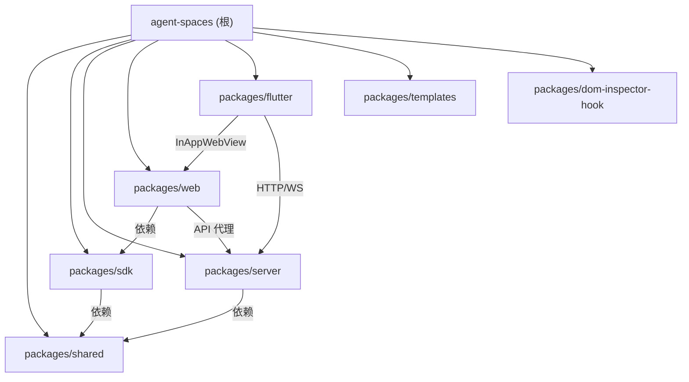

# Agent Spaces

Agent Spaces 是一个本地多 Agent 协同编程平台。pnpm monorepo，包含 7 个包：shared（类型定义）、sdk（API 调用层）、server（Express 5 后端）、web（Next.js 16 前端）、flutter（移动端壳应用）、templates（Agent 模板库）、dom-inspector-hook（DOM Inspector Hook）。支持 6 种 Agent 运行时、Workflow DAG 可视化编辑器、Monaco 编辑器 + TypeScript LSP、频道聊天、Git 操作、Issue 管理、Kanban 看板、文档数据库等核心功能。

## 约定的规则

- TypeScript strict 模式，ESNext 模块，后端 ESM
- 前端使用 Next.js App Router + `"use client"` 指令
- 状态管理统一使用 Zustand（web）/ Riverpod（flutter）
- 前端 API 调用统一通过 @agent-spaces/sdk（packages/sdk）
- UI 组件基于 shadcn/ui（base-nova 风格），CSS 使用 TailwindCSS
- API 路由按资源分组，RESTful 规则，Bearer Token 认证
- 数据持久化：JSON 文件 + SQLite，存储在 `~/.agent-spaces-data/`
- WebSocket 事件命名：`domain.action`
- i18n 使用 next-intl，按命名空间拆分（34 个命名空间）
- 文件名和目录名使用 kebab-case
- 本项目使用了 `codegraph` MCP 工具，提供基于 AST 的代码知识图谱

## 文件索引

| 文件 | 说明 |
|------|------|
| [claude/overview.md](claude/overview.md) | 项目总览、核心定位、技术栈、数据流 |
| [claude/conventions.md](claude/conventions.md) | 编码约定、命名规范、数据持久化规则 |
| [claude/module-responsibilities.md](claude/module-responsibilities.md) | 各模块职责概述 |
| [claude/entrypoints.md](claude/entrypoints.md) | 入口文件、启动命令、环境变量 |
| [claude/public-interfaces.md](claude/public-interfaces.md) | REST API、WebSocket 事件、页面路由、SDK |
| [claude/dependencies-and-config.md](claude/dependencies-and-config.md) | 依赖关系图、关键依赖、构建顺序、配置文件 |
| [claude/data-model.md](claude/data-model.md) | 持久化架构、核心类型、状态枚举 |
| [claude/testing-and-quality.md](claude/testing-and-quality.md) | 测试现状、验证命令、质量工具 |
| [claude/file-map.md](claude/file-map.md) | 文件地图、源码结构、文档目录 |
| [claude/faq.md](claude/faq.md) | 常见问题 |
| [claude/changelog.md](claude/changelog.md) | 变更记录 |

## 模块索引



| 模块 | 路径 | 语言 | 源文件数 | 职责 |
|------|------|------|----------|------|
| shared | `packages/shared` | TypeScript | 29 | 前后端共享类型定义 |
| sdk | `packages/sdk` | TypeScript | 39 | 前端 API 统一 SDK（39 个模块适配器） |
| server | `packages/server` | TypeScript | 173 | Express 5 后端 + WebSocket + Agent 编排引擎 |
| web | `packages/web` | TSX/TypeScript | 250+ | Next.js 16 前端 SPA（34 个 Store） |
| flutter | `packages/flutter` | Dart | 46 | Flutter 多平台壳应用 |
| templates | `packages/templates` | JSON/Markdown | 324+ | Agent 预设模板库（184 Agent + 6 Chat + 9 MCP + 15 Skill + 107 Plugin） |
| dom-inspector-hook | `packages/dom-inspector-hook` | TypeScript | 2 | DOM Inspector 浏览器端 Hook |

## 运行与开发

```bash
pnpm install          # 安装依赖
pnpm dev              # 并行启动 server(3100) + web(3000)
pnpm build            # 构建（shared -> sdk -> server -> web）
pnpm build:docker     # Docker 构建
pnpm clean            # 清理 dist/.next
```

## AI 使用指引

- `packages/web/AGENTS.md` -- Next.js 16 重要提示
- `packages/web/DESIGN.md` -- UI 设计规范（MiniMax 风格）
- `docs/` -- 40+ 项目文档，涵盖 Agent 运行时、Workflow、通知、LSP 等
- `PRD.md` -- 需求文档
- codegraph MCP -- 基于 AST 的代码知识图谱，优先于 grep/read

## 扫描状态

- **更新时间**：2026-06-09 11:04:09
- **已扫描范围**：全部 7 个模块的 package.json、入口文件、目录结构、关键配置
- **跳过范围**：node_modules、dist、.next、构建产物、二进制文件
- **覆盖率**：约 85%
- **缺口**：部分辅助工具文件、测试文件（极少）、部分 workflow-ui 子目录
