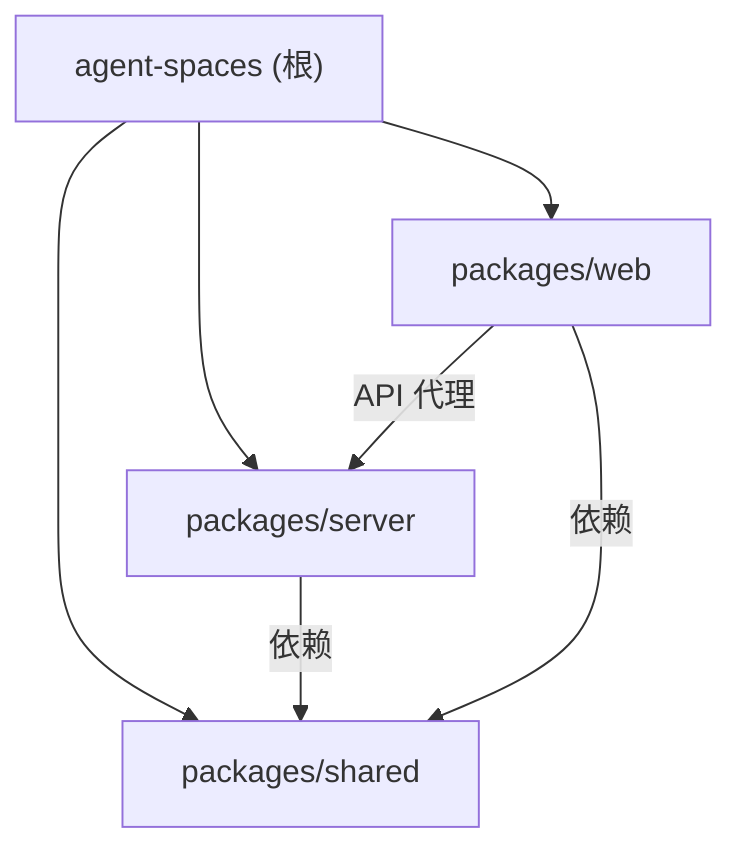

# Agent Spaces

## 项目愿景

Agent Spaces 是一个**本地多 Agent 协同编程平台**。用户在本地创建工作空间（Workspace），绑定代码目录，通过调度者（Scheduler）、策划者（Planner）、执行者（Executor）、审核者（Reviewer）四种 Agent 角色实现任务的自动分发、代码修改、审核与合并。前端提供 IDE 级别的集成开发环境体验，包含代码编辑器、终端、频道聊天、Git 操作、议题管理等核心功能。

## 架构总览

- **项目类型**：pnpm monorepo（3 个包）
- **前端**：Next.js 16 (App Router) + TailwindCSS 4 + shadcn/ui + FlexLayout + Zustand + Monaco Editor + xterm.js + TipTap 富文本编辑器
- **后端**：Express 5 + WebSocket (ws) + node-pty + simple-git
- **共享层**：TypeScript 类型定义包，前后端共用
- **数据存储**：JSON 文件持久化（`~/.agent-spaces-data/`），无数据库
- **Agent 运行时**：支持三种运行时 -- `OpenAgentSdkRuntime`（基于 @codeany/open-agent-sdk）、`ClaudeCodeRuntime`（基于 @anthropic-ai/claude-agent-sdk）、`CodexRuntime`（基于 @openai/codex-sdk），通过工厂函数 `createAgentRuntime()` 按配置切换
- **Anthropic Bridge**：ClaudeCodeRuntime 内置 Anthropic Messages 到 OpenAI Chat Completions/Responses 的协议中转，支持通过 Claude Code SDK 调用非 Anthropic 模型

### 技术栈

| 层级 | 技术 | 版本 |
|------|------|------|
| 运行时 | Node.js | >= 20 |
| 包管理 | pnpm | >= 9 |
| 语言 | TypeScript | 5.8+ |
| 前端框架 | Next.js | 16.2 |
| UI 库 | shadcn/ui (base-nova) + TailwindCSS 4 | - |
| 布局引擎 | FlexLayout React | 0.9 |
| 状态管理 | Zustand | 5 |
| 代码编辑 | Monaco Editor | 4.7 |
| 终端 | xterm.js (@xterm/xterm) | 6 |
| 富文本编辑 | TipTap (含 mention、placeholder 扩展) | 3.22 |
| 后端框架 | Express | 5 |
| WebSocket | ws | 8 |
| PTY | node-pty | 1.1 |
| Git 操作 | simple-git | 3.36 |
| Agent SDK 1 | @codeany/open-agent-sdk | ^0.2.1 |
| Agent SDK 2 | @anthropic-ai/claude-agent-sdk | ^0.2.126 |
| Agent SDK 3 | @openai/codex-sdk | ^0.128.0 |

## 模块结构图



## 模块索引

| 模块 | 路径 | 语言 | 职责 |
|------|------|------|------|
| shared | `packages/shared` | TypeScript | 前后端共享类型定义（Workspace, Issue, IssueComment, Task, Agent, Channel, Message, MessagePart, Event, File, Git, LLM, Tool） |
| server | `packages/server` | TypeScript | Express REST API + WebSocket 服务 + 三运行时 Agent 编排（OpenAgentSdk/ClaudeCode/Codex）+ PTY 终端 + Git 操作 + JSON 持久化 + LLM 管理 + Agent Preset + Function Call Tools + Anthropic Bridge + Issue 评论 + 工具详情持久化 |
| web | `packages/web` | TypeScript/TSX | Next.js 前端 SPA，包含代码编辑器、终端、结构化 AI 消息渲染（chain/tool detail/diff）、TipTap 富文本聊天 + @mention、议题管理、Git 面板、Agent 配置、LLM 管理、头像上传 |

## 运行与开发

```bash
# 安装依赖
pnpm install

# 并行启动 server + web（开发模式）
pnpm dev
# server: http://localhost:3100
# web:    http://localhost:3000（自动代理 /api/* 和 /ws 到 server）

# 构建
pnpm build

# 清理
pnpm clean
```

### 环境变量

| 变量 | 默认值 | 说明 |
|------|--------|------|
| `PORT` | `3100` | 后端服务端口 |
| `AGENT_SPACES_DATA_DIR` | `~/.agent-spaces-data` | 数据存储目录 |
| `ANTHROPIC_API_KEY` | - | ClaudeCodeRuntime 使用的 API Key |
| `ANTHROPIC_BASE_URL` | - | ClaudeCodeRuntime 使用的 API Base URL |
| `NEXT_PUBLIC_WS_PORT` | `3100` | 前端 WebSocket 连接端口 |
| `CODEX_API_KEY` / `OPENAI_API_KEY` | - | CodexRuntime 使用的 API Key |
| `CODEX_HOME` | - | Codex 配置目录（默认每个 agent 独立） |

### 核心开发流程

1. 创建工作空间 -> 绑定本地目录 -> 自动初始化 `.agentspace` 元数据目录
2. 配置 Agent Preset（角色、运行时类型、模型、API Key、MCP、技能、权限模式等）
3. 创建议题（Issue）-> 调度者自动唤醒策划者 -> 策划者分解任务 -> 任务创建者同步任务
4. 执行者执行任务（带依赖调度）-> 审核者审核 -> 依赖调度器判断是否完成 -> 议题状态流转
5. 也可在频道聊天中 @mention Agent 直接触发执行
6. Agent 执行时实时展示 chain（工具调用/中间输出/最终结论）、工具详情（input/output/diff）、token 使用统计
7. 所有状态变更通过 WebSocket 实时推送到前端

## 测试策略

当前为 MVP 阶段，暂无自动化测试。规划中的测试策略：

- **后端单元测试**：services/storage 层的 CRUD 与状态转换
- **后端集成测试**：REST API + WebSocket 事件端到端
- **Agent 编排测试**：Scheduler -> Planner -> TaskCreator -> Executor -> Reviewer 链路
- **Agent 运行时测试**：OpenAgentSdkRuntime / ClaudeCodeRuntime / CodexRuntime 的 execute/stop 行为
- **Anthropic Bridge 测试**：Anthropic Messages <-> OpenAI Chat/Responses 协议转换
- **前端组件测试**：关键 UI 组件的渲染与交互
- **Store 测试**：Zustand store 的状态变更逻辑

## 编码规范

- TypeScript strict 模式，ESNext 模块
- 后端使用 ESM（`"type": "module"`）
- 前端使用 Next.js App Router + `"use client"` 指令
- 状态管理统一使用 Zustand（`create` 函数式写法）
- 组件使用函数式组件 + hooks
- CSS 使用 TailwindCSS utility classes
- UI 组件基于 shadcn/ui（base-nova 风格），参考 `packages/web/DESIGN.md` 设计规范
- API 路由按资源分组，遵循 RESTful 规范
- WebSocket 事件命名：`domain.action`（如 `terminal.create`, `agent.status_changed`）
- 数据持久化使用 JSON 文件，每个实体独立文件 + index.json 索引
- Agent 编排使用 function-call tools（非 prompt-only），通过 `AgentFunctionTool` 抽象层统一管理
- 工具详情持久化到 `tool-details.json`，前端通过 API 懒加载

## AI 使用指引

- 本项目使用了 `code-review-graph` MCP 工具，提供知识图谱能力
- `packages/web/AGENTS.md` 包含 Next.js 16 重要提示（Breaking Changes）
- `packages/web/DESIGN.md` 包含 UI 设计规范（MiniMax 风格参考）
- `.agentspace/claude.md` 为工作空间级知识库
- `docs/agent-lifecycle.md` 详细描述 Agent Preset 的创建、更新、导入和运行时行为
- `docs/issue-agent-automation.md` 详细描述 Issue 自动化编排链路（Scheduler -> Planner -> TaskCreator -> Executor -> Reviewer）
- `docs/codex-runtime-limitations.md` 记录 Codex 运行时的已知限制与解决方法
- `docs/anthropic-bridge.md` 说明 Anthropic Messages 到 OpenAI 的协议中转机制
- `docs/function-call-tools.md` 描述 Agent Function Call 工具层
- `docs/ai-message-rendering.md` 描述 AI 消息的结构化渲染链路
- 项目规划文件：`PRD.md`（需求文档）

## MCP Tools: code-review-graph

**IMPORTANT: This project has a knowledge graph. ALWAYS use the
code-review-graph MCP tools BEFORE using Grep/Glob/Read to explore
the codebase.** The graph is faster, cheaper (fewer tokens), and gives
you structural context (callers, dependents, test coverage) that file
scanning cannot.

### When to use graph tools FIRST

- **Exploring code**: `semantic_search_nodes` or `query_graph` instead of Grep
- **Understanding impact**: `get_impact_radius` instead of manually tracing imports
- **Code review**: `detect_changes` + `get_review_context` instead of reading entire files
- **Finding relationships**: `query_graph` with callers_of/callees_of/imports_of/tests_for
- **Architecture questions**: `get_architecture_overview` + `list_communities`

Fall back to Grep/Glob/Read **only** when the graph doesn't cover what you need.

### Key Tools

| Tool | Use when |
|------|----------|
| `detect_changes` | Reviewing code changes -- gives risk-scored analysis |
| `get_review_context` | Need source snippets for review -- token-efficient |
| `get_impact_radius` | Understanding blast radius of a change |
| `get_affected_flows` | Finding which execution paths are impacted |
| `query_graph` | Tracing callers, callees, imports, tests, dependencies |
| `semantic_search_nodes` | Finding functions/classes by name or keyword |
| `get_architecture_overview` | Understanding high-level codebase structure |
| `refactor_tool` | Planning renames, finding dead code |

### Workflow

1. The graph auto-updates on file changes (via hooks).
2. Use `detect_changes` for code review.
3. Use `get_affected_flows` to understand impact.
4. Use `query_graph` pattern="tests_for" to check coverage.

## 变更记录 (Changelog)

| 时间 | 操作 | 说明 |
|------|------|------|
| 2026-05-04T21:04:42+08:00 | 增量更新 | 三运行时架构（新增 CodexRuntime + @openai/codex-sdk）、Anthropic Bridge 协议中转、Issue 自动化编排链路（TaskCreator + 依赖调度 + IssueComment + AgentProgress）、Function Call Tools 内置工具层、结构化 AI 消息渲染（MessagePart/chain/tool-detail/diff）、AgentConfig 大幅扩展（codex/avatarUrl/sandboxDirs/maxRetries/tools/permissionMode）、前端 agent store、5 篇新文档 |
| 2026-05-02T23:43:41 | 增量更新 | 补充双运行时架构、LLM 管理、Agent Preset 系统、TipTap 富文本编辑、mention 触发、DESIGN.md 规范、docs/agent-lifecycle.md 等新发现 |
| 2026-05-02T01:07:33 | 初始化 | init-architect 首次扫描生成根级与模块级 CLAUDE.md |
